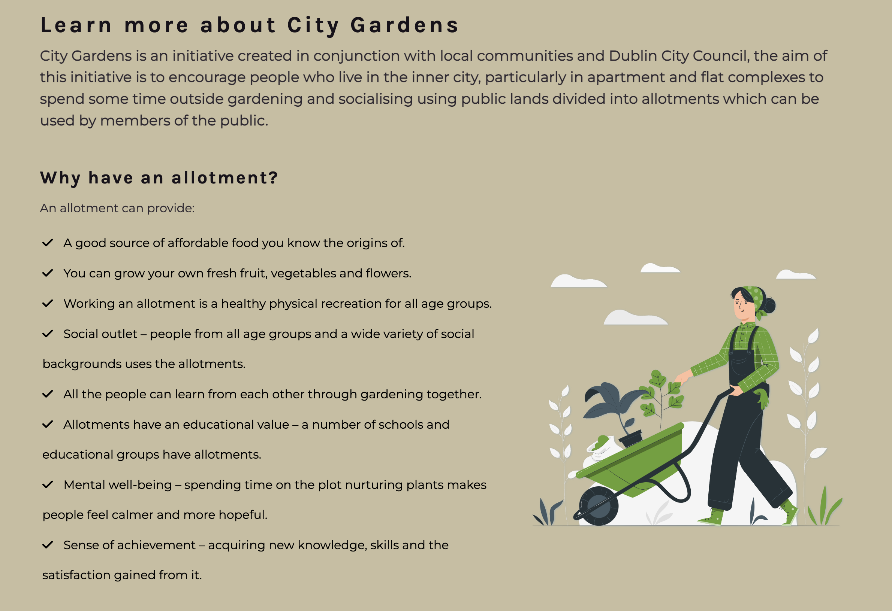
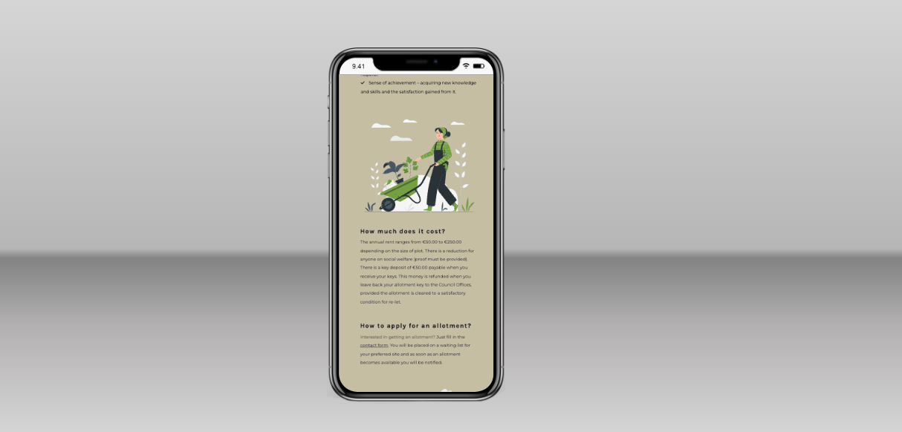
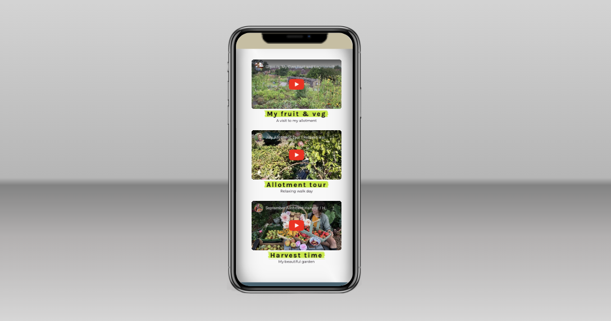

# CITY GARDENS

City Gardens is a website designed to connect potential and active users of the community garden allotments available in Dublin city, find their locations, enquire or apply and be informed on how to take the best use of them once taking part.

Link to the live site here: https://zest-studi-o.github.io/P01-Allotment-gardens/

# Table of contents

- [User Experience (UX)](#User-Experience-UX)

  - [Initial Discussion](#Initial-Discussion)
  - [User Stories](#User-Stories)

- [Design](#Design)

  - [Colour Scheme](#Colour-Scheme)
  - [Typography](#Typography)
  - [Imagery](#Imagery)
  - [Wireframes](#Wireframes)
  - [Features](#Features)
  - [Accessibility](#Accessibility)

- [Technologies Used](#Technologies-Used)

  - [Languages Used](#Languages-Used)
  - [Programs Used](#Programs-Used)

- [Deployment and Local Development](#Deployment-and-Local-Development)

  - [Deployment](#Deployment)
  - [Local Development](#Local-Development)
    - [How to Fork](#How-to-Fork)
    - [How to Clone](#How-to-Clone)

- [Testing](#Testing)
  - [Solved Bugs](#Solved-Bugs)
  - [Known Bugs](#known-Bugs)
- [Credits](#Credits)
  - [Content](#Content)
  - [Media](#Media)
  - [Reference material](#Reference-material)
  - [Acknowledgments](#Acknowledgments)

---

## User Experience (UX)

### Initial Discussion

City Gardens is an initiative created in conjunction with local communities and Dublin City Council, the aim is to encourage people who live in the inner city, particularly in apartments and flat complexes to spend some time outside gardening and socialising using public lands divided into allotments which can be used by members of the public.

People can take an allotment for gardening and producing fruit and vegetables, these are located in different parts of Dublin city, to allow people from different suburbs to participate in the initiative.

There is a small fee to be able to join and members need to optimally maintain the plot, optionally fruit and veg can be produced, and 10% of this produce can be sold at local markets so the community gardens can have further social events, core funding is provided by Dublin City Hall and the fees. When first signing up people receive a free starter pack including a gardening and horticulture book to make the best use of the land.

The purpose of the website is to highlight the availability of the service, where the allotments are located and offer a facility for users to find information such as contact details, growing guides and gardening tips. The allotments are available for people of all ages and skill sets.

#### Key information for the site

- What is City Gardens and what does it offer.
- What is currently going on in the community garden.
- How to take part in the initiative and become a member.
- A way of contacting City Gardens and enquiring or providing suggestions.
- Where to find the locations for the allotment.

### User Stories

#### User Goals

- As a user I want to have the site displayed clearly on different devices.
- As a user I want to find information on what is City Gardens and how to participate.
- As a user I want to know exactly where the gardens are located.
- As a user I want to be able to contact City Gardens with any queries or suggestions.

#### First Time Visitor Goals

- As a first time visitor I want to know what City Gardens is and how to participate.
- As a first time visitor I want to find the locations of the allotments.
- As a first time visitor I want to be able to find their contact details.
- As a first time visitor I want to navigate the site easily on all my devices.
- As a first time visitor I want to see the results of the produce with videos and photos.

#### Returning Visitor Goals

- As a returning visitor I want to find images and videos of the allotments.
- As a returning visitor I want to be able to easily contact City Gardens with further questions I might have.

#### Frequent Visitor Goals

- As a frequent visitor I want to see images of the people that participate in City Gardens.

---

## Design

### Colour Scheme

There was some colour exploration using [Adobe Colour Wheel](https://color.adobe.com/create/color-wheel) website, some colours were brought to Coolors website extracted from imagery planned to use on the site to further explore the visual possibilities.

The colour palette selected uses a mix of tones based on an eggplant theme, it uses a very trendy bright green colour combined with shades of greys and blacks, to complement the eggplant colour which is used in the imagery. The colours have high contrast and light colours are used against dark background colours and vice versa.
The final colour palette was created using the [Coolors](https://coolors.co/) website.
Some other alternatives and shades based on the selected palette were:
[Tomato vine palette](docs/palette-tomato-vine.png)
[Violet field palette](docs/palette-violet-field.png)

The final colour palette used in the website was slightly altered after testing validator suggestions of improving the contrast and changing the header and footer for a darker hue colour #426473, a drop shadow was also added to the text elements in the header to improve readability.

The background colour for the about us section was also changed for a sand colour #c8bea0 which conveys nature as it is the colour of soil and goes well with the other colours used in the site and imagery. After testing, it was observed that this background colour makes the text easier to read.

### Typography

The fonts were taken from Google Fonts:

- Karla is used for headings and subheadings on the site. It is a serif font that combines well with the body copy font, which is sans-serif, serif and sans-serif fonts offer good contrast.

- Montserrat is used for the body text on the site. It is a sans-serif font with good readability optimal to use for web design.

- Lobster is used on the logo with a slight drop shadow for better visibility. It is a display cursive font. The logo leaf icon was taken from font awesome and combined with this font.

### Imagery

The images are taken from the royalty free sites credited [here](#Credits).

### Wireframes

Wireframes for desktop, tablet and mobile versions as follows:

- Home page

- Locations page

- Gallery page

- Contact us page

### Features

#### Existing Features

This website has four pages that can be accessed from the navigation menu (home page, locations page, gallery and contact us page) it also has a thank you page that can be accessed when sending a form.

- **All pages have:**
 - The Sites title.
    - This redirects the user to the home page by clicking on the logo.
    - The user can simply click on it to come back to the home page at any time, providing an easy user experience.

 - A navigation bar that is responsive and adjusts depending on the screen sizes via media queries. 

    

    - This will allow the user to navigate easily from any of the pages.
    - For desktop screen sizes the navigation bar is on the right-hand side.
    - For tablet screen sizes the navigation bar is under the logo for an optimal display.
    - For mobile screen sizes the navigation menu is a burger toggler which makes things easier for the user by being able to collapse the content when not needed or clicking on it to expand it.

    

- A footer with links to social media.
    - These links open in a new tab for easy navigation.
    - The user will find value by being encouraged to connect via social media.

    

- **Home Page.**
  - Hero section.
    - This shows an image of a member of City Gardens in the allotments with a banner that describes that the page is about allotments in Dublin.
    - This introduces the user to City Gardens and makes it easy to understand what the site is about.
    - Having a picture of a City Gardens member connects with the user and helps to create a positive impact and engage.
    - This hero image with its overlay text banner is responsive for all screen sizes.

   

   
   
  - About us section.
    - This explains to the user what is City Gardens, the reasons to have an allotment and how to take part.
    - This is valuable to the user as it contains relevant information and answers to the most common questions.

    
    
    

    - This section is responsive and adjusts using the flex-box and also media queries, this allows the text and images to adjust and on smaller screens to be displayed in a row which can be optimally visualised by the user.

    

  - Video section.
    - This links to videos on relevant content such as how is it having an allotment, or harvesting the produce.
    - The user finds value in seeing other people with allotments speaking about them and see what to expect.

    

    - The videos go in one row for tablet and phone screen sizes to fit better the space and cause an optimal user experience.

    

- **Locations page.**
  - Cards with images of the locations.
  - Information with address and contact details and a link to google maps.
  - The user can find easily the locations by clicking on the map, this section also has a contact email address for the particular location.
  - The locations page is designed to be fully responsive showing the content in three rows for desktop version, two for medium screens and one for smaller screens.

   

   

- **Gallery.**
  - Image gallery.
    - This section has a gallery of images from participants and the allotments themselves.
    - This is valuable to the user as they can see other members and how the allotments look like, which produce they can obtain, generating a positive response.

    

    - The gallery section is also responsive taking one row for smaller devices to facilitate viewing the images as they will enlarge in smaller screen sizes so the user can scroll through them.

     

- **Contact us page.**
  - Form.
    - This section has a contact form in which the user can further enquire about how to join or any other queries they might have. The form has input fields for name, surname, email address, radio buttons to select the location preferred and a box in which they can include their question, there is a contact us button call to action, it uses form validation, so the user must fill up all the information to be able to submit.
    - The user can find an easy way to contact City Gardens to apply for an allotment and also to ask general questions or make suggestions.

    

    - This form page is designed to be responsive in all screen sizes and adjusts to tablets and phones using the flex-box model and  media queries.

    

- **Thank you page.**
  - Once the form is submitted successfully the page thanks and redirects the user to the home page in 10s.
  - Thank you pages are known to provide a good user experience as they confirm the form submission and thank the users for their time, creating a positive feeling.
    

### Features Left to Implement

In the future, I would like to:

- Add some animations to the images.
- Implement further form validations by adding JS to differentiate between numbers from different countries and validate them.
- Create individual pages for each location, that the user could easily access by clicking on the cards in the locations section.
- Create a search bar and a filter for the locations to be able to sort and find.
- Create another web page for social events.
- Promote the website using banners that encourage the user to apply and get a free starter pack. 

### Accessibility

It is important to have a website that is accessibility friendly, this objective was achieved by:

- Ensuring that images have an alt attribute.
- Using aria labels.
- Using semantic html.
- Making sure that background and foreground colours have high contrast, after an error returned in the nav bar by the lighthouse validator the background colour darkness was increased to contrast higher with the white color applied to the font, the logo also has a drop shadow to enhance visibility and the clickable menu for mobile screens uses a visible font size.
- Using a sans serif font is recommended for web design which is easy to read.
- Adding titles to iframes.

---

## Technologies Used

### Languages Used

HTML and CSS were used to create this website.

### Programs Used

[Balsamiq](https://balsamiq.com/wireframes/) - Used to create wireframes.

[Git](https://git-scm.com/) - For version control.

[Github](https://github.com/) - To save and store the files for the website.

[Gitpod](https://www.gitpod.io/) - To write, edit and save code.

[Google Fonts](https://fonts.google.com/) - To import fonts for the website.

[Font Awesome](https://fontawesome.com/icons) - To add icons to the website.

[Tiny PNG](https://tinypng.com/) - To quickly compress imagery.

[Convertio](https://convertio.co/) - To convert to webp format.

[Birme]( https://www.birme.net/?auto_height=true&image_format=webp) - To convert to webp format.

[Photoshop](https://www.adobe.com/ie/products/photoshop.html) - To edit, resize, crop to size and web optimise imagery.

[Illustrator](https://www.adobe.com/ie/products/illustrator.html) - For the fav icon creation.

[Shields](https://shields.io/) - To add badges to readme.

[Amiresponsive](https://ui.dev/amiresponsive) - To generate a mockup in different screen sizes.

[Techsini](https://techsini.com/multi-mockup/) - To generate individual mockups.

---

## Deployment and Local Development

### Deployment

Github Pages were used to deploy the live website. The instructions to achieve this are below:

1. Log in (or sign up) to Github.
2. Find the repository for this project, P01-Allotment-garden.
3. Click on the Settings link.
4. Click on the Pages link in the left-hand side navigation bar.
5. In the Source section, choose main from the drop-down select branch menu. Select Root from the drop-down select folder menu.
6. Click Save. Your live Github Pages site is now deployed at the URL shown.

### Local Development

#### How to Fork

To fork the P01-Allotment-gardens repository:

1. Log in (or sign up) to Github.
2. Go to the repository for this project, Zest-studi-o/P01-Allotment-gardens.
3. Click the Fork button in the top right corner.

#### How to Clone

To clone the P01-Allotment-gardens repository:

1. Log in (or sign up) to GitHub.
2. Go to the repository for this project, Zest-studi-o/P01-Allotment-gardens.
3. Click on the code button, select whether you would like to clone with HTTPS, SSH or GitHub CLI and copy the link shown.
4. Open the terminal in your code editor and change the current working directory to the location you want to use for the cloned directory.
5. Type 'git clone' into the terminal and then paste the link you copied in step 3. Press enter.

---

## Testing

Please refer to [TESTING.md](TESTING.md) file for all testing carried out.

### Solved Bugs

| ID  | CLASS | FEATURE          | DESCRIPTION                                                                          | STEPS TO REPRODUCE                                                                                                                                                           | ACTUAL RESULT                                                                                                                                  | EXPECTED RESULT                                                            | ACTION                                                                                                        | STATUS |
| --- | ----- | ---------------- | ------------------------------------------------------------------------------------ | ---------------------------------------------------------------------------------------------------------------------------------------------------------------------------- | ---------------------------------------------------------------------------------------------------------------------------------------------- | -------------------------------------------------------------------------- | ------------------------------------------------------------------------------------------------------------- | ------ |
| 1   | A     | Footer           | Footer not aligning at the bottom                                                    | Go to the website > Click on any page e.g.home > Observe the issue with the white space in the footer                                                                                      | The footer leaves a white gap between it and the content                                                                                                                   | Footer correctly positioned                             | Add more content and position absolute for the footer and work with padding bottom                                                                | FIXED  |
| 2   | A     | Video section    | The text is hidden behind the videos and is unreadable       |      Go to the website > Click on home > Reduce screen size to table or mobile version > Observe the issue with the text being hidden behind the videos  | The text going with the videos is unreadable and these are misplaced | Videos and text correctly distributed and centered for all screen sizes    | Add padding to the videos when they stack one on top of the other for medium and small screen sizes           | FIXED  |
| 3   | A     | Video section    | Issue with media queries; the right video does not accept the style.                 | Go to the website > Click on home > Scroll to the video section > Observe the issue with video right not being responsive                                                      | All videos fully responsive                                                                                                                    | Video on the right not responsive                                          | Fixed the typo on "right"                                                                                     | FIXED  |
| 4   | A     | Nav bar          | Nav bar background not taking the grey background colour and floating on a white gap | Go to the website > Click on any page e.g.home > Observe the issue with the white space in the nav bar                                                               | The nav bar does not display correctly and some content is clipped or with a white gap for certain screen sizes                                 | The nav bar displays correctly                                             | Fixed by adjusting specified heights, margin and padding on the header element                                | FIXED  |
| 5   | A     | Hero image       | Issue with hero image not centered when reducing screen size                         | Go to the website > Click on home > Open dev tools > Select a small screen eg. IPhone12 Pro > Observe the issue with the hero image alignment                                   | The hero image is not aligned                                                                                                                  | The hero image should be correctly aligned for all screen sizes            | Edit image size and add adjusted ones with media queries                                                      | FIXED  |
| 6   | B     | Footer           | Footer after a long gap for small screens                                            | Go to the website > Click on contact > Open dev tools > Select a small screen eg. IPhone12 Pro > Observe the issue with the gap not filled with content after the submit button | Some negative spacing after the submit button                                                                                                  | All the content is centered with no extra negative spacing at the bottom   | Delete specified height in one of the media queries                                                          | FIXED  |
| 8   | C     | About us section | Misalignment of the bulleted list in about us section                                | Go to the website > Click on home > Swap to different screen sizes with dev tools > Observe the issue with the bulleted list misaligned                                       | The list is not correctly aligned for certain screen sizes                                                                                     | The list is correctly aligned for all screen sizes                         | Worked with padding for the section and added font awesome for bullet points                                   | FIXED  |
| 9   | C     | Locations        | Slight misalignment of the cards group in location page                              | Go to the website > Click on locations in desktop view > Observe the issue with the alignment                                                                                 | The cards are not correctly aligned for desktop screen sizes                                                                                    | The cards appear aligned and centered                                      | Use of the row css property                                                                                   | FIXED  |
| 10  | A     | Locations        | Issue when reducing the screen to achieve 2 rows centered in locations tab           | Go to the website > Click on locations > Open dev tools and select a tablet size > Observe the issue with one of the cards floating down and leaving a white space instead     | Three column cards for desktop, two column cards for tablet, one column card for phone                                                         | Use of the row css property                                                | Use of the row css property                                                                                   | FIXED  |
| 11  | B     | Nav bar          | Active link on the nav menu not working                                              | Go to the website > Click on any page eg. home > Observe the issue with the active style not taking effect                                                                    | The active page is not highlighted                                                                                                             | The active page is highlighted to indicate the user what page are they on   | Added !important tab to the css                                                                               | FIXED  |
| 12  | A     | Nav bar          | Wrong order of the listed items when seeing the page in small screens                | Go to the website > Click on dev tools and select a small mobile screen size > Observe the issue with the listed items in the nav bar being in the wrong order                  | The nav bar displays the items in a not user friendly manner contact, locations, home                                                          | The nav bar will display home, locations and contact                       | Change order in html of the elements, then float left menu li and float right menu for larger screens         | FIXED  |
| 13  | A     | Contact form             | Some of the radio buttons float to the next line if the screen size it is small      | Go to the website > Click on the form page > Open dev tools > Select a small screen e.g. Pixel 5 > Observe the issue with the radio button input not being beside its label      | The radio button input and its label it is not aligned in small screens                                                                        | Ensure that radio button labels and input are aligned for all screen sizes | Add a span to the label and radio button, assign a class and then apply display block for small screens to it | FIXED  |
| 14  | A     | Video             | The rounded border radius is not taking effect after the media query is applied      | Go to the website > Click on the form page > Open dev tools > Select a small screen e.g. Pixel 5 > Observe the issue with the videos lacking the border radius style applied      | The border radius is not applied and the videos have an awkward positioning when looking at them with the dev tools                                                                        | Ensure that the videos and positioning is correct for all screen sizes | Swap the floats for the flex-box model as they were causing issues with styles displaying and positioning. | FIXED  |
| 15  | A     | Contact form             | The phone number validation does not take Irish numbers starting in 085      | Go to the website > Click on the contact form page > Enter your details > Select phone and attempt to enter digits starting with 085 > Observe the issue with the form not validating those      | The form does not validate numbers starting with 085                                                                        | Ensure that the form validates all numbers | Delete the pattern for Irish numbers after user feedback, as one user reported that could not enter a number starting in 085 and another that would like to enter any other numbers, not only Irish. Changed this for a different pattern that accepts a minimum input of five numbers | FIXED  |

### known Bugs

There are no remaining known bugs, all of them have been fixed.

---

## Credits

### Content

- [Sdcc](https://www.sdcc.ie/en/services/sport-and-recreation/allotments/#:~:text=The%20annual%20rent%20ranges%20from,on%20the%20size%20of%20plot.)
- [Dublin City Council](https://www.dublincity.ie/residential/improving-my-community/allotments-and-community-gardens)
- [Nsalg](https://www.nsalg.org.uk/allotment-info/benefits-of-allotment-gardening/)

### Media

- [Pexels - Andrea Piacquadio - Woman in blue planting veg](https://www.pexels.com/es-es/foto/foto-de-mujer-plantando-verduras-1023397/)
- [Pexels - Andrea Piacquadio - Woman in blue and wheelbarrow](https://www.pexels.com/es-es/foto/foto-de-mujer-sosteniendo-carretilla-1023404/)
- [Freepik - Cookie Studio - Handsome man in the garden](https://www.freepik.com/free-photo/rural-morning-close-up-beautiful-bearded-caucasian-male-farmer-blue-t-shirt-black-pants-smiling-working-farm-picking-crop-doing-favorite-job_9696954.htm#from_view=detail_alsolike)
- [Freepik - Prostooleh - Woman working in the garden](https://www.freepik.com/free-photo/woman-hat-working-garden_9659554.htm)
- [Freepik - Prostooleh - Senior holding veg basket](https://www.freepik.com/free-photo/close-up-old-farmer-holding-basket-vegetables-man-is-standing-garden-senior-black-apron_10065490.htm)
- [Freepik - Prostooleh - Beautiful couple works in the garden](https://www.freepik.com/free-photo/beautiful-couple-works-garden_5557123.htm#query=beautiful%20couple%20works%20in%20a%20garden&position=35&from_view=search&track=ais)
- [Freepik - Couple working in the garden](https://www.freepik.com/free-photo/overhead-view-male-female-gardener-working-vegetable-garden_4636256.htm)
- [Unsplash - Elias Morr - Green and purple veg in a bowl](https://unsplash.com/es/fotos/0bA5dqPyLgg)
- [Freepik - Veggies with eggplant](https://www.freepik.com/free-photo/top-view-veggies-with-eggplant_9402961.htm)
- [Freepik - Woman holding tomatoes and basil](https://www.freepik.com/free-photo/portrait-female-farmer-working-alone-her-greenhouse_17622274.htm#&position=11&from_view=collections)
- [Unsplash - Jonathan kemper - Close up gardener's hand and a plant](https://unsplash.com/photos/1HHrdIoLFpU)
- [Pexels - Mariam Antadze - Potatoes on veil](https://www.pexels.com/es-es/foto/patatas-en-velo-transparente-en-campo-5913196/)
- [Pixabay -Allotment garden](https://pixabay.com/photos/allotment-garden-garden-flower-beds-1059/)
- [Freepik - Organic Aubergines](https://www.freepik.com/free-photo/close-up-fresh-organic-eggplant-garden_11176085.htm#query=aubergine%20garden&position=1&from_view=search&track=ais)
- [Youtube - Growing My Own Fruit and Veg - A Visit to my Allotment](https://www.youtube.com/watch?v=Aku-AGbwejw)
- [Youtube - September Allotment Harvest - Homegrown Garden](https://www.youtube.com/watch?v=FbbfeHShIk0)
- [Youtube - July Allotment Tour - Relaxed walk round the fruit and veg](https://youtu.be/dlxsQxmwV5k)
- [Font awesome - Leaf](https://fontawesome.com/icons/pagelines?f=brands&s=solid)
- [Flaticon - Gardening](https://www.flaticon.com/free-icon/gardening_1973742?term=garden&page=1&position=1&origin=search&related_id=1973742)
- [Freepik - Storyset - Gardening illustrations - Pana](https://storyset.com/illustration/gardening/pana)
- [Freepik - Storyset - Gardening illustrations - Cuate](https://storyset.com/illustration/gardening/cuate)
- [Freepik - Free Mockup](https://www.freepik.com/free-psd/premium-mobile-phone-screen-mockup-template_4219875.htm#query=phone%20mock%20up&position=49&from_view=search&track=ais)

### Reference material

- [Love Running Walkthrough project](https://github.com/Code-Institute-Solutions/love-running-2.0-sourcecode)
- [Love Running Walkthrough project readme template](https://github.com/Code-Institute-Solutions/readme-template)
- [Bully Book Club readme example](https://github.com/kera-cudmore/Bully-Book-Club/blob/main/README.md)
- [kera Cudmore readme examples](https://github.com/kera-cudmore/readme-examples)
- [kera Cudmore readme template](https://github.com/kera-cudmore/readme-examples/blob/main/milestone1-readme.md)
- [kera Cudmore - The Quiz Arms](https://github.com/kera-cudmore/TheQuizArms)
- [Creating your first readme](https://www.youtube.com/watch?v=XbYJ4VlhSnY&ab_channel=CodeInstitute)
- [How to create a table of contents in markdown](https://www.youtube.com/watch?v=6V5yaVhK_hE&ab_channel=LinuxWorkshop)
- [Markdown table generator](https://www.tablesgenerator.com/markdown_tables#)
- [Stackoverflow: create a table of contents](https://stackoverflow.com/questions/11948245/markdown-to-create-pages-and-table-of-contents)
- [Correct embed url](https://total.wpexplorer.com/docs/get-embed-urllink-youtube-video/)
- [Header image sizing guide](https://www.lauraleeflores.com/blog/header-image-sizing-guide)
- [Ultimate Guide to Hero Images](https://blog.hubspot.com/marketing/hero-image#:~:text=The%20ideal%20size%20for%20a,size%20up%20to%201%2C800%20pixels.)
- [Best image size for website](https://tiny-img.com/blog/best-image-size-for-website/)
- [W3 schools](https://www.w3schools.com/)
- [How to keep your footer where it belongs?](https://www.freecodecamp.org/news/how-to-keep-your-footer-where-it-belongs-59c6aa05c59c/)
- [Remove white space from the footer](https://stackoverflow.com/questions/34188161/remove-white-space-below-footer)
- [Color hexa](https://www.colorhexa.com/)
- [Styling Placeholder Text with CSS](https://www.samanthaming.com/tidbits/57-styling-css-placeholder/)
- [How to center a HTML form in CSS](https://devpractical.com/center-form-in-html-css/)
- [CSS cards](https://www.w3schools.com/howto/howto_css_cards.asp)
- [Column cards](https://www.w3schools.com/howto/howto_css_column_cards.asp)
- [Flexbox](https://flexbox.malven.co/)
- [Grids](https://grid.malven.co/)
- [Get started with the grid WITHOUT being overwhelmed](https://www.youtube.com/watch?v=8QSqwbSztnA&t=1s&ab_channel=KevinPowell)
- [How to highlight text in CSS](https://alvarotrigo.com/blog/css-highlight-text/)
- [Highlight Text CSS: 7 Cool CSS Highlight Text Effects](https://www.coding-dude.com/wp/css/highlight-text-css/)
- [Bullet points using font awesome](https://hollypryce.com/font-awesome-bullet-points/)
- [Stackoverflow - Font awesome icon bullet points](https://stackoverflow.com/questions/12468359/using-font-awesome-icon-for-bullet-points-with-a-single-list-item-element)
- [Drop shadow for pngs in CSS](https://www.w3docs.com/snippets/css/how-to-create-a-drop-shadow-for-png-image.html)
- [Grid Gallery - Free code camp](https://www.freecodecamp.org/news/how-to-create-an-image-gallery-with-css-grid-e0f0fd666a5c/)
- [A Complete Guide to CSS Grid](https://css-tricks.com/snippets/css/complete-guide-grid/)
- [A Complete Guide to CSS Flexbox](https://css-tricks.com/snippets/css/a-guide-to-flexbox/)
- [Mdn webdocs - HTML attribute: minlength](https://developer.mozilla.org/en-US/docs/Web/HTML/Attributes/minlength)
- [Creating a responsive mobile menu with CSS without JavaScript](https://blog.logrocket.com/create-responsive-mobile-menu-with-css-no-javascript/)

### Acknowledgments

- [Derek MCAuley](https://github.com/derekmcauley7), my Code Institute Mentor.
- Tutor support at Code Institute.
- Alan, course facilitator, for the advice.
- Jarek Bonk, cohort colleague, for his help with the grid, when I ran out of tutor hours.
- Paul Treggiden, project-milestone-1 slack member, for his help with fixing bug 12.
- Carl Murray, peer-code-review slack member, for his feedback.
# CITY GARDENS

City Gardens is a website designed to connect potential and active users of the community garden allotments available in Dublin city, find their locations, enquire or apply and be informed on how to take the best use of them once taking part.

Link to the live site here: https://zest-studi-o.github.io/P01-Allotment-gardens/

# Table of contents

- [User Experience (UX)](#User-Experience-UX)

  - [Initial Discussion](#Initial-Discussion)
  - [User Stories](#User-Stories)

- [Design](#Design)

  - [Colour Scheme](#Colour-Scheme)
  - [Typography](#Typography)
  - [Imagery](#Imagery)
  - [Wireframes](#Wireframes)
  - [Features](#Features)
  - [Accessibility](#Accessibility)

- [Technologies Used](#Technologies-Used)

  - [Languages Used](#Languages-Used)
  - [Programs Used](#Programs-Used)

- [Deployment and Local Development](#Deployment-and-Local-Development)

  - [Deployment](#Deployment)
  - [Local Development](#Local-Development)
    - [How to Fork](#How-to-Fork)
    - [How to Clone](#How-to-Clone)

- [Testing](#Testing)
  - [Solved Bugs](#Solved-Bugs)
  - [Known Bugs](#known-Bugs)
- [Credits](#Credits)
  - [Content](#Content)
  - [Media](#Media)
  - [Reference material](#Reference-material)
  - [Acknowledgments](#Acknowledgments)

---

## User Experience (UX)

### Initial Discussion

City Gardens is an initiative created in conjunction with local communities and Dublin City Council, the aim is to encourage people who live in the inner city, particularly in apartments and flat complexes to spend some time outside gardening and socialising using public lands divided into allotments which can be used by members of the public.

People can take an allotment for gardening and producing fruit and vegetables, these are located in different parts of Dublin city, to allow people from different suburbs to participate in the initiative.

There is a small fee to be able to join and members need to optimally maintain the plot, optionally fruit and veg can be produced, and 10% of this produce can be sold at local markets so the community gardens can have further social events, core funding is provided by Dublin City Hall and the fees. When first signing up people receive a free starter pack including a gardening and horticulture book to make the best use of the land.

The purpose of the website is to highlight the availability of the service, where the allotments are located and offer a facility for users to find information such as contact details, growing guides and gardening tips. The allotments are available for people of all ages and skill sets.

#### Key information for the site

- What is City Gardens and what does it offer.
- What is currently going on in the community garden.
- How to take part in the initiative and become a member.
- A way of contacting City Gardens and enquiring or providing suggestions.
- Where to find the locations for the allotment.

### User Stories

#### User Goals

- As a user I want to have the site displayed clearly on different devices.
- As a user I want to find information on what is City Gardens and how to participate.
- As a user I want to know exactly where the gardens are located.
- As a user I want to be able to contact City Gardens with any queries or suggestions.

#### First Time Visitor Goals

- As a first time visitor I want to know what City Gardens is and how to participate.
- As a first time visitor I want to find the locations of the allotments.
- As a first time visitor I want to be able to find their contact details.
- As a first time visitor I want to navigate the site easily on all my devices.
- As a first time visitor I want to see the results of the produce with videos and photos.

#### Returning Visitor Goals

- As a returning visitor I want to find images and videos of the allotments.
- As a returning visitor I want to be able to easily contact City Gardens with further questions I might have.

#### Frequent Visitor Goals

- As a frequent visitor I want to see images of the people that participate in City Gardens.

---

## Design

### Colour Scheme

There was some colour exploration using [Adobe Colour Wheel](https://color.adobe.com/create/color-wheel) website, some colours were brought to Coolors website extracted from imagery planned to use on the site to further explore the visual possibilities.

The colour palette selected uses a mix of tones based on an eggplant theme, it uses a very trendy bright green colour combined with shades of greys and blacks, to complement the eggplant colour which is used in the imagery. The colours have high contrast and light colours are used against dark background colours and vice versa.
The final colour palette was created using the [Coolors](https://coolors.co/) website.
Some other alternatives and shades based on the selected palette were:
[Tomato vine palette](docs/palette-tomato-vine.png)
[Violet field palette](docs/palette-violet-field.png)

The final colour palette used in the website was slightly altered after testing validator suggestions of improving the contrast and changing the header and footer for a darker hue colour #426473, a drop shadow was also added to the text elements in the header to improve readability.

The background colour for the about us section was also changed for a sand colour #c8bea0 which conveys nature as it is the colour of soil and goes well with the other colours used in the site and imagery. After testing, it was observed that this background colour makes the text easier to read.

### Typography

The fonts were taken from Google Fonts:

- Karla is used for headings and subheadings on the site. It is a serif font that combines well with the body copy font, which is sans-serif, serif and sans-serif fonts offer good contrast.

- Montserrat is used for the body text on the site. It is a sans-serif font with good readability optimal to use for web design.

- Lobster is used on the logo with a slight drop shadow for better visibility. It is a display cursive font. The logo leaf icon was taken from font awesome and combined with this font.

### Imagery

The images are taken from the royalty free sites credited [here](#Credits).

### Wireframes

Wireframes for desktop, tablet and mobile versions as follows:

- Home page

- Locations page

- Gallery page

- Contact us page

### Features

#### Existing Features

This website has four pages that can be accessed from the navigation menu (home page, locations page, gallery and contact us page) it also has a thank you page that can be accessed when sending a form.

- **All pages have:**
 - The Sites title.
    - This redirects the user to the home page by clicking on the logo.
    - The user can simply click on it to come back to the home page at any time, providing an easy user experience.

 - A navigation bar that is responsive and adjusts depending on the screen sizes via media queries. 

    

    - This will allow the user to navigate easily from any of the pages.
    - For desktop screen sizes the navigation bar is on the right-hand side.
    - For tablet screen sizes the navigation bar is under the logo for an optimal display.
    - For mobile screen sizes the navigation menu is a burger toggler which makes things easier for the user by being able to collapse the content when not needed or clicking on it to expand it.

    

- A footer with links to social media.
    - These links open in a new tab for easy navigation.
    - The user will find value by being encouraged to connect via social media.

    

- **Home Page.**
  - Hero section.
    - This shows an image of a member of City Gardens in the allotments with a banner that describes that the page is about allotments in Dublin.
    - This introduces the user to City Gardens and makes it easy to understand what the site is about.
    - Having a picture of a City Gardens member connects with the user and helps to create a positive impact and engage.
    - This hero image with its overlay text banner is responsive for all screen sizes.

   

   
   
  - About us section.
    - This explains to the user what is City Gardens, the reasons to have an allotment and how to take part.
    - This is valuable to the user as it contains relevant information and answers to the most common questions.

    
    
    

    - This section is responsive and adjusts using the flex-box and also media queries, this allows the text and images to adjust and on smaller screens to be displayed in a row which can be optimally visualised by the user.

    

  - Video section.
    - This links to videos on relevant content such as how is it having an allotment, or harvesting the produce.
    - The user finds value in seeing other people with allotments speaking about them and see what to expect.

    

    - The videos go in one row for tablet and phone screen sizes to fit better the space and cause an optimal user experience.

    

- **Locations page.**
  - Cards with images of the locations.
  - Information with address and contact details and a link to google maps.
  - The user can find easily the locations by clicking on the map, this section also has a contact email address for the particular location.
  - The locations page is designed to be fully responsive showing the content in three rows for desktop version, two for medium screens and one for smaller screens.

   

   

- **Gallery.**
  - Image gallery.
    - This section has a gallery of images from participants and the allotments themselves.
    - This is valuable to the user as they can see other members and how the allotments look like, which produce they can obtain, generating a positive response.

    

    - The gallery section is also responsive taking one row for smaller devices to facilitate viewing the images as they will enlarge in smaller screen sizes so the user can scroll through them.

     

- **Contact us page.**
  - Form.
    - This section has a contact form in which the user can further enquire about how to join or any other queries they might have. The form has input fields for name, surname, email address, radio buttons to select the location preferred and a box in which they can include their question, there is a contact us button call to action, it uses form validation, so the user must fill up all the information to be able to submit.
    - The user can find an easy way to contact City Gardens to apply for an allotment and also to ask general questions or make suggestions.

    

    - This form page is designed to be responsive in all screen sizes and adjusts to tablets and phones using the flex-box model and  media queries.

    

- **Thank you page.**
  - Once the form is submitted successfully the page thanks and redirects the user to the home page in 10s.
  - Thank you pages are known to provide a good user experience as they confirm the form submission and thank the users for their time, creating a positive feeling.
    

### Features Left to Implement

In the future, I would like to:

- Add some animations to the images.
- Implement further form validations by adding JS to differentiate between numbers from different countries and validate them.
- Create individual pages for each location, that the user could easily access by clicking on the cards in the locations section.
- Create a search bar and a filter for the locations to be able to sort and find.
- Create another web page for social events.
- Promote the website using banners that encourage the user to apply and get a free starter pack. 

### Accessibility

It is important to have a website that is accessibility friendly, this objective was achieved by:

- Ensuring that images have an alt attribute.
- Using aria labels.
- Using semantic html.
- Making sure that background and foreground colours have high contrast, after an error returned in the nav bar by the lighthouse validator the background colour darkness was increased to contrast higher with the white color applied to the font, the logo also has a drop shadow to enhance visibility and the clickable menu for mobile screens uses a visible font size.
- Using a sans serif font is recommended for web design which is easy to read.
- Adding titles to iframes.

---

## Technologies Used

### Languages Used

HTML and CSS were used to create this website.

### Programs Used

[Balsamiq](https://balsamiq.com/wireframes/) - Used to create wireframes.

[Git](https://git-scm.com/) - For version control.

[Github](https://github.com/) - To save and store the files for the website.

[Gitpod](https://www.gitpod.io/) - To write, edit and save code.

[Google Fonts](https://fonts.google.com/) - To import fonts for the website.

[Font Awesome](https://fontawesome.com/icons) - To add icons to the website.

[Tiny PNG](https://tinypng.com/) - To quickly compress imagery.

[Convertio](https://convertio.co/) - To convert to webp format.

[Birme]( https://www.birme.net/?auto_height=true&image_format=webp) - To convert to webp format.

[Photoshop](https://www.adobe.com/ie/products/photoshop.html) - To edit, resize, crop to size and web optimise imagery.

[Illustrator](https://www.adobe.com/ie/products/illustrator.html) - For the fav icon creation.

[Shields](https://shields.io/) - To add badges to readme.

[Amiresponsive](https://ui.dev/amiresponsive) - To generate a mockup in different screen sizes.

[Techsini](https://techsini.com/multi-mockup/) - To generate individual mockups.

---

## Deployment and Local Development

### Deployment

Github Pages were used to deploy the live website. The instructions to achieve this are below:

1. Log in (or sign up) to Github.
2. Find the repository for this project, P01-Allotment-garden.
3. Click on the Settings link.
4. Click on the Pages link in the left-hand side navigation bar.
5. In the Source section, choose main from the drop-down select branch menu. Select Root from the drop-down select folder menu.
6. Click Save. Your live Github Pages site is now deployed at the URL shown.

### Local Development

#### How to Fork

To fork the P01-Allotment-gardens repository:

1. Log in (or sign up) to Github.
2. Go to the repository for this project, Zest-studi-o/P01-Allotment-gardens.
3. Click the Fork button in the top right corner.

#### How to Clone

To clone the P01-Allotment-gardens repository:

1. Log in (or sign up) to GitHub.
2. Go to the repository for this project, Zest-studi-o/P01-Allotment-gardens.
3. Click on the code button, select whether you would like to clone with HTTPS, SSH or GitHub CLI and copy the link shown.
4. Open the terminal in your code editor and change the current working directory to the location you want to use for the cloned directory.
5. Type 'git clone' into the terminal and then paste the link you copied in step 3. Press enter.

---

## Testing

Please refer to [TESTING.md](TESTING.md) file for all testing carried out.

### Solved Bugs

| ID  | CLASS | FEATURE          | DESCRIPTION                                                                          | STEPS TO REPRODUCE                                                                                                                                                           | ACTUAL RESULT                                                                                                                                  | EXPECTED RESULT                                                            | ACTION                                                                                                        | STATUS |
| --- | ----- | ---------------- | ------------------------------------------------------------------------------------ | ---------------------------------------------------------------------------------------------------------------------------------------------------------------------------- | ---------------------------------------------------------------------------------------------------------------------------------------------- | -------------------------------------------------------------------------- | ------------------------------------------------------------------------------------------------------------- | ------ |
| 1   | A     | Footer           | Footer not aligning at the bottom                                                    | Go to the website > Click on home > Observe the issue with the white space in the footer                                                                                      | The footer leaves a white gap between it and the content                                                                                                                   | Footer correctly positioned                             | Add more content and position absolute for the footer and work with padding bottom                                                                | FIXED  |
| 2   | A     | Video section    | The text is hidden behing the videos and is unreadable | Go to the website > Click on home > Reduce screen size to table or mobile version > Observe the issue with the text being hidden behind the videos                                                                             | The text beside the videos is not visible and videos are stacked on top of each other with no correct and visible margin or padding | Videos and text correctly distributed and centered for all screen sizes    | Add padding to the videos when they stack one on top of the other for medium and small screen sizes           | FIXED  |
| 3   | A     | Video section    | Issue with media queries; the right video does not accept the style.                 | Go to the website > Click on home > Scroll to the video section > Observe the issue with video right not being responsive                                                      | All videos fully responsive                                                                                                                    | Video on the right not responsive                                          | Fixed the typo on "right"                                                                                     | FIXED  |
| 4   | A     | Nav bar          | Nav bar background not taking the grey background colour and floating on a white gap | The nav bar does not display correctly and some content is cropped or with a white gap in certain screen sizes                                                               | The nav bar does not display correctly and some content is cropped or with a white gap in certain screen sizes                                 | The nav bar displays correctly                                             | Fixed by adjusting specified heights, margin and padding on the header element                                | FIXED  |
| 5   | A     | Hero image       | Issue with hero image not centered when reducing screen size                         | Go to the website > Click on home > Open dev tools > Select a small screen eg. IPhone12 Pro > Observe the issue with the hero image alignment                                   | The hero image is not aligned                                                                                                                  | The hero image should be correctly aligned for all screen sizes            | Edit image size and add adjusted ones with media queries                                                      | FIXED  |
| 6   | B     | Footer           | Footer after a long gap for small screens                                            | Go to the website > Click on contact > Open dev tools > Select a small screen eg. IPhone12 Pro > Observe the issue with the gap not filled with content after the submit button | Some negative spacing after the submit button                                                                                                  | All the content is centered with no extra negative spacing at the bottom   | Delete specified height in one of the media queries                                                          | FIXED  |
| 8   | C     | About us section | Misalignment of the bulleted list in about us section                                | Go to the website > Click on home > Swap to different screen sizes with dev tools > Observe the issue with the bulleted list misaligned                                       | The list is not correctly aligned for certain screen sizes                                                                                     | The list is correctly aligned for all screen sizes                         | Worked with padding for the section and added font awesome for bullet points                                   | FIXED  |
| 9   | C     | Locations        | Slight misalignment of the cards group in location page                              | Go to the website > Click on locations in desktop view > Observe the issue with the alignment                                                                                 | The cards are not correctly aligned for desktop screen sizes                                                                                    | The cards appear aligned and centered                                      | Use of the row css property                                                                                   | FIXED  |
| 10  | A     | Locations        | Issue when reducing the screen to achieve 2 rows centered in locations tab           | Go to the website > Click on locations > Open dev tools and select a tablet size > Observe the issue with one of the cards floating down and leaving a white space instead     | Three column cards for desktop, two column cards for tablet, one column card for phone                                                         | Use of the row css property                                                | Use of the row css property                                                                                   | FIXED  |
| 11  | B     | Nav bar          | Active link on the nav menu not working                                              | Go to the website > Click on any page eg. home > Observe the issue with the active style not taking effect                                                                    | The active page is not highlighted                                                                                                             | The active page is highlighted to indicate the user what page are they on   | Added !important tab to the css                                                                               | FIXED  |
| 12  | A     | Nav bar          | Wrong order of the listed items when seeing the page in small screens                | Go to the website > Click on dev tools and select a small mobile screen size > Observe the issue with the listed items in the nav bar being in the wrong order                  | The nav bar displays the items in a not user friendly manner contact, locations, home                                                          | The nav bar will display home, locations and contact                       | Change order in html of the elements, then float left menu li and float right menu for larger screens         | FIXED  |
| 13  | A     | Contact form             | Some of the radio buttons float to the next line if the screen size it is small      | Go to the website > Click on the form page > Open dev tools > Select a small screen e.g. Pixel 5 > Observe the issue with the radio button input not being beside its label      | The radio button input and its label it is not aligned in small screens                                                                        | Ensure that radio button labels and input are aligned for all screen sizes | Add a span to the label and radio button, assign a class and then apply display block for small screens to it | FIXED  |
| 14  | A     | Video             | The rounded border radius is not taking effect after the media query is applied      | Go to the website > Click on the form page > Open dev tools > Select a small screen e.g. Pixel 5 > Observe the issue with the videos lacking the border radius style applied      | The border radius is not applied and the videos have an awkward positioning when looking at them with the dev tools                                                                        | Ensure that the videos and positioning is correct for all screen sizes | Swap the floats for the flex-box model as they were causing issues with styles displaying and positioning. | FIXED  |
| 15  | A     | Contact form             | The phone number validation does not take Irish numbers starting in 085      | Go to the website > Click on the contact form page > Enter your details > Select phone and attempt to enter digits starting with 085 > Observe the issue with the form not validating those      | The form does not validate numbers starting with 085                                                                        | Ensure that the form validates all numbers | Delete the pattern for Irish numbers after user feedback, as one user reported that could not enter a number starting in 085 and another that would like to enter any other numbers, not only Irish. Changed this for a different pattern that accepts a minimum input of five numbers | FIXED  |

### known Bugs

There are no remaining known bugs, all of them have been fixed.

---

## Credits

### Content

- [Sdcc](https://www.sdcc.ie/en/services/sport-and-recreation/allotments/#:~:text=The%20annual%20rent%20ranges%20from,on%20the%20size%20of%20plot.)
- [Dublin City Council](https://www.dublincity.ie/residential/improving-my-community/allotments-and-community-gardens)
- [Nsalg](https://www.nsalg.org.uk/allotment-info/benefits-of-allotment-gardening/)

### Media

- [Pexels - Andrea Piacquadio - Woman in blue planting veg](https://www.pexels.com/es-es/foto/foto-de-mujer-plantando-verduras-1023397/)
- [Pexels - Andrea Piacquadio - Woman in blue and wheelbarrow](https://www.pexels.com/es-es/foto/foto-de-mujer-sosteniendo-carretilla-1023404/)
- [Freepik - Cookie Studio - Handsome man in the garden](https://www.freepik.com/free-photo/rural-morning-close-up-beautiful-bearded-caucasian-male-farmer-blue-t-shirt-black-pants-smiling-working-farm-picking-crop-doing-favorite-job_9696954.htm#from_view=detail_alsolike)
- [Freepik - Prostooleh - Woman working in the garden](https://www.freepik.com/free-photo/woman-hat-working-garden_9659554.htm)
- [Freepik - Prostooleh - Senior holding veg basket](https://www.freepik.com/free-photo/close-up-old-farmer-holding-basket-vegetables-man-is-standing-garden-senior-black-apron_10065490.htm)
- [Freepik - Prostooleh - Beautiful couple works in the garden](https://www.freepik.com/free-photo/beautiful-couple-works-garden_5557123.htm#query=beautiful%20couple%20works%20in%20a%20garden&position=35&from_view=search&track=ais)
- [Freepik - Couple working in the garden](https://www.freepik.com/free-photo/overhead-view-male-female-gardener-working-vegetable-garden_4636256.htm)
- [Unsplash - Elias Morr - Green and purple veg in a bowl](https://unsplash.com/es/fotos/0bA5dqPyLgg)
- [Freepik - Veggies with eggplant](https://www.freepik.com/free-photo/top-view-veggies-with-eggplant_9402961.htm)
- [Freepik - Woman holding tomatoes and basil](https://www.freepik.com/free-photo/portrait-female-farmer-working-alone-her-greenhouse_17622274.htm#&position=11&from_view=collections)
- [Unsplash - Jonathan kemper - Close up gardener's hand and a plant](https://unsplash.com/photos/1HHrdIoLFpU)
- [Pexels - Mariam Antadze - Potatoes on veil](https://www.pexels.com/es-es/foto/patatas-en-velo-transparente-en-campo-5913196/)
- [Pixabay -Allotment garden](https://pixabay.com/photos/allotment-garden-garden-flower-beds-1059/)
- [Freepik - Organic Aubergines](https://www.freepik.com/free-photo/close-up-fresh-organic-eggplant-garden_11176085.htm#query=aubergine%20garden&position=1&from_view=search&track=ais)
- [Youtube - Growing My Own Fruit and Veg - A Visit to my Allotment](https://www.youtube.com/watch?v=Aku-AGbwejw)
- [Youtube - September Allotment Harvest - Homegrown Garden](https://www.youtube.com/watch?v=FbbfeHShIk0)
- [Youtube - July Allotment Tour - Relaxed walk round the fruit and veg](https://youtu.be/dlxsQxmwV5k)
- [Font awesome - Leaf](https://fontawesome.com/icons/pagelines?f=brands&s=solid)
- [Flaticon - Gardening](https://www.flaticon.com/free-icon/gardening_1973742?term=garden&page=1&position=1&origin=search&related_id=1973742)
- [Freepik - Storyset - Gardening illustrations - Pana](https://storyset.com/illustration/gardening/pana)
- [Freepik - Storyset - Gardening illustrations - Cuate](https://storyset.com/illustration/gardening/cuate)
- [Freepik - Free Mockup](https://www.freepik.com/free-psd/premium-mobile-phone-screen-mockup-template_4219875.htm#query=phone%20mock%20up&position=49&from_view=search&track=ais)

### Reference material

- [Love Running Walkthrough project](https://github.com/Code-Institute-Solutions/love-running-2.0-sourcecode)
- [Love Running Walkthrough project readme template](https://github.com/Code-Institute-Solutions/readme-template)
- [Bully Book Club readme example](https://github.com/kera-cudmore/Bully-Book-Club/blob/main/README.md)
- [kera Cudmore readme examples](https://github.com/kera-cudmore/readme-examples)
- [kera Cudmore readme template](https://github.com/kera-cudmore/readme-examples/blob/main/milestone1-readme.md)
- [kera Cudmore - The Quiz Arms](https://github.com/kera-cudmore/TheQuizArms)
- [Creating your first readme](https://www.youtube.com/watch?v=XbYJ4VlhSnY&ab_channel=CodeInstitute)
- [How to create a table of contents in markdown](https://www.youtube.com/watch?v=6V5yaVhK_hE&ab_channel=LinuxWorkshop)
- [Markdown table generator](https://www.tablesgenerator.com/markdown_tables#)
- [Stackoverflow: create a table of contents](https://stackoverflow.com/questions/11948245/markdown-to-create-pages-and-table-of-contents)
- [Correct embed url](https://total.wpexplorer.com/docs/get-embed-urllink-youtube-video/)
- [Header image sizing guide](https://www.lauraleeflores.com/blog/header-image-sizing-guide)
- [Ultimate Guide to Hero Images](https://blog.hubspot.com/marketing/hero-image#:~:text=The%20ideal%20size%20for%20a,size%20up%20to%201%2C800%20pixels.)
- [Best image size for website](https://tiny-img.com/blog/best-image-size-for-website/)
- [W3 schools](https://www.w3schools.com/)
- [How to keep your footer where it belongs?](https://www.freecodecamp.org/news/how-to-keep-your-footer-where-it-belongs-59c6aa05c59c/)
- [Remove white space from the footer](https://stackoverflow.com/questions/34188161/remove-white-space-below-footer)
- [Color hexa](https://www.colorhexa.com/)
- [Styling Placeholder Text with CSS](https://www.samanthaming.com/tidbits/57-styling-css-placeholder/)
- [How to center a HTML form in CSS](https://devpractical.com/center-form-in-html-css/)
- [CSS cards](https://www.w3schools.com/howto/howto_css_cards.asp)
- [Column cards](https://www.w3schools.com/howto/howto_css_column_cards.asp)
- [Flexbox](https://flexbox.malven.co/)
- [Grids](https://grid.malven.co/)
- [Get started with the grid WITHOUT being overwhelmed](https://www.youtube.com/watch?v=8QSqwbSztnA&t=1s&ab_channel=KevinPowell)
- [How to highlight text in CSS](https://alvarotrigo.com/blog/css-highlight-text/)
- [Highlight Text CSS: 7 Cool CSS Highlight Text Effects](https://www.coding-dude.com/wp/css/highlight-text-css/)
- [Bullet points using font awesome](https://hollypryce.com/font-awesome-bullet-points/)
- [Stackoverflow - Font awesome icon bullet points](https://stackoverflow.com/questions/12468359/using-font-awesome-icon-for-bullet-points-with-a-single-list-item-element)
- [Drop shadow for pngs in CSS](https://www.w3docs.com/snippets/css/how-to-create-a-drop-shadow-for-png-image.html)
- [Grid Gallery - Free code camp](https://www.freecodecamp.org/news/how-to-create-an-image-gallery-with-css-grid-e0f0fd666a5c/)
- [A Complete Guide to CSS Grid](https://css-tricks.com/snippets/css/complete-guide-grid/)
- [A Complete Guide to CSS Flexbox](https://css-tricks.com/snippets/css/a-guide-to-flexbox/)
- [Mdn webdocs - HTML attribute: minlength](https://developer.mozilla.org/en-US/docs/Web/HTML/Attributes/minlength)
- [Creating a responsive mobile menu with CSS without JavaScript](https://blog.logrocket.com/create-responsive-mobile-menu-with-css-no-javascript/)

### Acknowledgments

- [Derek MCAuley](https://github.com/derekmcauley7), my Code Institute Mentor.
- Tutor support at Code Institute.
- Alan, course facilitator, for the advice.
- Jarek Bonk, cohort colleague, for his help with the grid, when I ran out of tutor hours.
- Paul Treggiden, project-milestone-1 slack member, for his help with fixing bug 12.
- Carl Murray, peer-code-review slack member, for his feedback.
# CITY GARDENS

City Gardens is a website designed to connect potential and active users of the community garden allotments available in Dublin city, find their locations, enquire or apply and be informed on how to take the best use of them once taking part.

Link to the live site here: https://zest-studi-o.github.io/P01-Allotment-gardens/

# Table of contents

- [User Experience (UX)](#User-Experience-UX)

  - [Initial Discussion](#Initial-Discussion)
  - [User Stories](#User-Stories)

- [Design](#Design)

  - [Colour Scheme](#Colour-Scheme)
  - [Typography](#Typography)
  - [Imagery](#Imagery)
  - [Wireframes](#Wireframes)
  - [Features](#Features)
  - [Accessibility](#Accessibility)

- [Technologies Used](#Technologies-Used)

  - [Languages Used](#Languages-Used)
  - [Programs Used](#Programs-Used)

- [Deployment and Local Development](#Deployment-and-Local-Development)

  - [Deployment](#Deployment)
  - [Local Development](#Local-Development)
    - [How to Fork](#How-to-Fork)
    - [How to Clone](#How-to-Clone)

- [Testing](#Testing)
  - [Solved Bugs](#Solved-Bugs)
  - [Known Bugs](#known-Bugs)
- [Credits](#Credits)
  - [Content](#Content)
  - [Media](#Media)
  - [Reference material](#Reference-material)
  - [Acknowledgments](#Acknowledgments)

---

## User Experience (UX)

### Initial Discussion

City Gardens is an initiative created in conjunction with local communities and Dublin City Council, the aim is to encourage people who live in the inner city, particularly in apartments and flat complexes to spend some time outside gardening and socialising using public lands divided into allotments which can be used by members of the public.

People can take an allotment for gardening and producing fruit and vegetables, these are located in different parts of Dublin city, to allow people from different suburbs to participate in the initiative.

There is a small fee to be able to join and members need to optimally maintain the plot, optionally fruit and veg can be produced, and 10% of this produce can be sold at local markets so the community gardens can have further social events, core funding is provided by Dublin City Hall and the fees. When first signing up people receive a free starter pack including a gardening and horticulture book to make the best use of the land.

The purpose of the website is to highlight the availability of the service, where the allotments are located and offer a facility for users to find information such as contact details, growing guides and gardening tips. The allotments are available for people of all ages and skill sets.

#### Key information for the site

- What is City Gardens and what does it offer.
- What is currently going on in the community garden.
- How to take part in the initiative and become a member.
- A way of contacting City Gardens and enquiring or providing suggestions.
- Where to find the locations for the allotment.

### User Stories

#### User Goals

- As a user I want to have the site displayed clearly on different devices.
- As a user I want to find information on what is City Gardens and how to participate.
- As a user I want to know exactly where the gardens are located.
- As a user I want to be able to contact City Gardens with any queries or suggestions.

#### First Time Visitor Goals

- As a first time visitor I want to know what City Gardens is and how to participate.
- As a first time visitor I want to find the locations of the allotments.
- As a first time visitor I want to be able to find their contact details.
- As a first time visitor I want to navigate the site easily on all my devices.
- As a first time visitor I want to see the results of the produce with videos and photos.

#### Returning Visitor Goals

- As a returning visitor I want to find images and videos of the allotments.
- As a returning visitor I want to be able to easily contact City Gardens with further questions I might have.

#### Frequent Visitor Goals

- As a frequent visitor I want to see images of the people that participate in City Gardens.

---

## Design

### Colour Scheme

There was some colour exploration using [Adobe Colour Wheel](https://color.adobe.com/create/color-wheel) website, some colours were brought to Coolors website extracted from imagery planned to use on the site to further explore the visual possibilities.

The colour palette selected uses a mix of tones based on an eggplant theme, it uses a very trendy bright green colour combined with shades of greys and blacks, to complement the eggplant colour which is used in the imagery. The colours have high contrast and light colours are used against dark background colours and vice versa.
The final colour palette was created using the [Coolors](https://coolors.co/) website.
Some other alternatives and shades based on the selected palette were:
[Tomato vine palette](docs/palette-tomato-vine.png)
[Violet field palette](docs/palette-violet-field.png)

The final colour palette used in the website was slightly altered after testing validator suggestions of improving the contrast and changing the header and footer for a darker hue colour #426473, a drop shadow was also added to the text elements in the header to improve readability.

The background colour for the about us section was also changed for a sand colour #c8bea0 which conveys nature as it is the colour of soil and goes well with the other colours used in the site and imagery. After testing, it was observed that this background colour makes the text easier to read.

### Typography

The fonts were taken from Google Fonts:

- Karla is used for headings and subheadings on the site. It is a serif font that combines well with the body copy font, which is sans-serif, serif and sans-serif fonts offer good contrast.

- Montserrat is used for the body text on the site. It is a sans-serif font with good readability optimal to use for web design.

- Lobster is used on the logo with a slight drop shadow for better visibility. It is a display cursive font. The logo leaf icon was taken from font awesome and combined with this font.

### Imagery

The images are taken from the royalty free sites credited [here](#Credits).

### Wireframes

Wireframes for desktop, tablet and mobile versions as follows:

- Home page

- Locations page

- Gallery page

- Contact us page

### Features

#### Existing Features

This website has four pages that can be accessed from the navigation menu (home page, locations page, gallery and contact us page) it also has a thank you page that can be accessed when sending a form.

- **All pages have:**
 - The Sites title.
    - This redirects the user to the home page by clicking on the logo.
    - The user can simply click on it to come back to the home page at any time, providing an easy user experience.

 - A navigation bar that is responsive and adjusts depending on the screen sizes via media queries. 

    

    - This will allow the user to navigate easily from any of the pages.
    - For desktop screen sizes the navigation bar is on the right-hand side.
    - For tablet screen sizes the navigation bar is under the logo for an optimal display.
    - For mobile screen sizes the navigation menu is a burger toggler which makes things easier for the user by being able to collapse the content when not needed or clicking on it to expand it.

    

- A footer with links to social media.
    - These links open in a new tab for easy navigation.
    - The user will find value by being encouraged to connect via social media.

    

- **Home Page.**
  - Hero section.
    - This shows an image of a member of City Gardens in the allotments with a banner that describes that the page is about allotments in Dublin.
    - This introduces the user to City Gardens and makes it easy to understand what the site is about.
    - Having a picture of a City Gardens member connects with the user and helps to create a positive impact and engage.
    - This hero image with its overlay text banner is responsive for all screen sizes.

   

   
   
  - About us section.
    - This explains to the user what is City Gardens, the reasons to have an allotment and how to take part.
    - This is valuable to the user as it contains relevant information and answers to the most common questions.

    
    
    

    - This section is responsive and adjusts using the flex-box and also media queries, this allows the text and images to adjust and on smaller screens to be displayed in a row which can be optimally visualised by the user.

    

  - Video section.
    - This links to videos on relevant content such as how is it having an allotment, or harvesting the produce.
    - The user finds value in seeing other people with allotments speaking about them and see what to expect.

    

    - The videos go in one row for tablet and phone screen sizes to fit better the space and cause an optimal user experience.

    

- **Locations page.**
  - Cards with images of the locations.
  - Information with address and contact details and a link to google maps.
  - The user can find easily the locations by clicking on the map, this section also has a contact email address for the particular location.
  - The locations page is designed to be fully responsive showing the content in three rows for desktop version, two for medium screens and one for smaller screens.

   

   

- **Gallery.**
  - Image gallery.
    - This section has a gallery of images from participants and the allotments themselves.
    - This is valuable to the user as they can see other members and how the allotments look like, which produce they can obtain, generating a positive response.

    

    - The gallery section is also responsive taking one row for smaller devices to facilitate viewing the images as they will enlarge in smaller screen sizes so the user can scroll through them.

     

- **Contact us page.**
  - Form.
    - This section has a contact form in which the user can further enquire about how to join or any other queries they might have. The form has input fields for name, surname, email address, radio buttons to select the location preferred and a box in which they can include their question, there is a contact us button call to action, it uses form validation, so the user must fill up all the information to be able to submit.
    - The user can find an easy way to contact City Gardens to apply for an allotment and also to ask general questions or make suggestions.

    

    - This form page is designed to be responsive in all screen sizes and adjusts to tablets and phones using the flex-box model and  media queries.

    

- **Thank you page.**
  - Once the form is submitted successfully the page thanks and redirects the user to the home page in 10s.
  - Thank you pages are known to provide a good user experience as they confirm the form submission and thank the users for their time, creating a positive feeling.
    

### Features Left to Implement

In the future, I would like to:

- Add some animations to the images.
- Implement further form validations by adding JS to differentiate between numbers from different countries and validate them.
- Create individual pages for each location, that the user could easily access by clicking on the cards in the locations section.
- Create a search bar and a filter for the locations to be able to sort and find.
- Create another web page for social events.
- Promote the website using banners that encourage the user to apply and get a free starter pack. 

### Accessibility

It is important to have a website that is accessibility friendly, this objective was achieved by:

- Ensuring that images have an alt attribute.
- Using aria labels.
- Using semantic html.
- Making sure that background and foreground colours have high contrast, after an error returned in the nav bar by the lighthouse validator the background colour darkness was increased to contrast higher with the white color applied to the font, the logo also has a drop shadow to enhance visibility and the clickable menu for mobile screens uses a visible font size.
- Using a sans serif font is recommended for web design which is easy to read.
- Adding titles to iframes.

---

## Technologies Used

### Languages Used

HTML and CSS were used to create this website.

### Programs Used

[Balsamiq](https://balsamiq.com/wireframes/) - Used to create wireframes.

[Git](https://git-scm.com/) - For version control.

[Github](https://github.com/) - To save and store the files for the website.

[Gitpod](https://www.gitpod.io/) - To write, edit and save code.

[Google Fonts](https://fonts.google.com/) - To import fonts for the website.

[Font Awesome](https://fontawesome.com/icons) - To add icons to the website.

[Tiny PNG](https://tinypng.com/) - To quickly compress imagery.

[Convertio](https://convertio.co/) - To convert to webp format.

[Birme]( https://www.birme.net/?auto_height=true&image_format=webp) - To convert to webp format.

[Photoshop](https://www.adobe.com/ie/products/photoshop.html) - To edit, resize, crop to size and web optimise imagery.

[Illustrator](https://www.adobe.com/ie/products/illustrator.html) - For the fav icon creation.

[Shields](https://shields.io/) - To add badges to readme.

[Amiresponsive](https://ui.dev/amiresponsive) - To generate a mockup in different screen sizes.

[Techsini](https://techsini.com/multi-mockup/) - To generate individual mockups.

---

## Deployment and Local Development

### Deployment

Github Pages were used to deploy the live website. The instructions to achieve this are below:

1. Log in (or sign up) to Github.
2. Find the repository for this project, P01-Allotment-garden.
3. Click on the Settings link.
4. Click on the Pages link in the left-hand side navigation bar.
5. In the Source section, choose main from the drop-down select branch menu. Select Root from the drop-down select folder menu.
6. Click Save. Your live Github Pages site is now deployed at the URL shown.

### Local Development

#### How to Fork

To fork the P01-Allotment-gardens repository:

1. Log in (or sign up) to Github.
2. Go to the repository for this project, Zest-studi-o/P01-Allotment-gardens.
3. Click the Fork button in the top right corner.

#### How to Clone

To clone the P01-Allotment-gardens repository:

1. Log in (or sign up) to GitHub.
2. Go to the repository for this project, Zest-studi-o/P01-Allotment-gardens.
3. Click on the code button, select whether you would like to clone with HTTPS, SSH or GitHub CLI and copy the link shown.
4. Open the terminal in your code editor and change the current working directory to the location you want to use for the cloned directory.
5. Type 'git clone' into the terminal and then paste the link you copied in step 3. Press enter.

---

## Testing

Please refer to [TESTING.md](TESTING.md) file for all testing carried out.

### Solved Bugs

| ID  | CLASS | FEATURE          | DESCRIPTION                                                                          | STEPS TO REPRODUCE                                                                                                                                                           | ACTUAL RESULT                                                                                                                                  | EXPECTED RESULT                                                            | ACTION                                                                                                        | STATUS |
| --- | ----- | ---------------- | ------------------------------------------------------------------------------------ | ---------------------------------------------------------------------------------------------------------------------------------------------------------------------------- | ---------------------------------------------------------------------------------------------------------------------------------------------- | -------------------------------------------------------------------------- | ------------------------------------------------------------------------------------------------------------- | ------ |
| 1   | A     | Footer           | Footer not aligning at the bottom                                                    | Go to the website > Click on any page e.g.home > Observe the issue with the white space in the footer                                                                                      | The footer leaves a white gap between it and the content                                                                                                                   | Footer correctly positioned                             | Add more content and position absolute for the footer and work with padding bottom                                                                | FIXED  |
| 2   | A     | Video section    | Text going to the back of the videos and being unreadable                            | The text is hidden behind the videos                                                                                                                                         | Go to the website > Click on home > Reduce screen size to table or mobile version > Observe the issue with the text being hidden behind the videos | Videos and text correctly distributed and centered for all screen sizes    | Add padding to the videos when they stack one on top of the other for medium and small screen sizes           | FIXED  |
| 3   | A     | Video section    | Issue with media queries; the right video does not accept the style.                 | Go to the website > Click on home > Scroll to the video section > Observe the issue with video right not being responsive                                                      | All videos fully responsive                                                                                                                    | Video on the right not responsive                                          | Fixed the typo on "right"                                                                                     | FIXED  |
| 4   | A     | Nav bar          | Nav bar background not taking the grey background colour and floating on a white gap | Go to the website > Click on any page e.g.home > Observe the issue with the white space in the nav bar                                                               | The nav bar does not display correctly and some content is clipped or with a white gap for certain screen sizes                                 | The nav bar displays correctly                                             | Fixed by adjusting specified heights, margin and padding on the header element                                | FIXED  |
| 5   | A     | Hero image       | Issue with hero image not centered when reducing screen size                         | Go to the website > Click on home > Open dev tools > Select a small screen eg. IPhone12 Pro > Observe the issue with the hero image alignment                                   | The hero image is not aligned                                                                                                                  | The hero image should be correctly aligned for all screen sizes            | Edit image size and add adjusted ones with media queries                                                      | FIXED  |
| 6   | B     | Footer           | Footer after a long gap for small screens                                            | Go to the website > Click on contact > Open dev tools > Select a small screen eg. IPhone12 Pro > Observe the issue with the gap not filled with content after the submit button | Some negative spacing after the submit button                                                                                                  | All the content is centered with no extra negative spacing at the bottom   | Delete specified height in one of the media queries                                                          | FIXED  |
| 8   | C     | About us section | Misalignment of the bulleted list in about us section                                | Go to the website > Click on home > Swap to different screen sizes with dev tools > Observe the issue with the bulleted list misaligned                                       | The list is not correctly aligned for certain screen sizes                                                                                     | The list is correctly aligned for all screen sizes                         | Worked with padding for the section and added font awesome for bullet points                                   | FIXED  |
| 9   | C     | Locations        | Slight misalignment of the cards group in location page                              | Go to the website > Click on locations in desktop view > Observe the issue with the alignment                                                                                 | The cards are not correctly aligned for desktop screen sizes                                                                                    | The cards appear aligned and centered                                      | Use of the row css property                                                                                   | FIXED  |
| 10  | A     | Locations        | Issue when reducing the screen to achieve 2 rows centered in locations tab           | Go to the website > Click on locations > Open dev tools and select a tablet size > Observe the issue with one of the cards floating down and leaving a white space instead     | Three column cards for desktop, two column cards for tablet, one column card for phone                                                         | Use of the row css property                                                | Use of the row css property                                                                                   | FIXED  |
| 11  | B     | Nav bar          | Active link on the nav menu not working                                              | Go to the website > Click on any page eg. home > Observe the issue with the active style not taking effect                                                                    | The active page is not highlighted                                                                                                             | The active page is highlighted to indicate the user what page are they on   | Added !important tab to the css                                                                               | FIXED  |
| 12  | A     | Nav bar          | Wrong order of the listed items when seeing the page in small screens                | Go to the website > Click on dev tools and select a small mobile screen size > Observe the issue with the listed items in the nav bar being in the wrong order                  | The nav bar displays the items in a not user friendly manner contact, locations, home                                                          | The nav bar will display home, locations and contact                       | Change order in html of the elements, then float left menu li and float right menu for larger screens         | FIXED  |
| 13  | A     | Contact form             | Some of the radio buttons float to the next line if the screen size it is small      | Go to the website > Click on the form page > Open dev tools > Select a small screen e.g. Pixel 5 > Observe the issue with the radio button input not being beside its label      | The radio button input and its label it is not aligned in small screens                                                                        | Ensure that radio button labels and input are aligned for all screen sizes | Add a span to the label and radio button, assign a class and then apply display block for small screens to it | FIXED  |
| 14  | A     | Video             | The rounded border radius is not taking effect after the media query is applied      | Go to the website > Click on the form page > Open dev tools > Select a small screen e.g. Pixel 5 > Observe the issue with the videos lacking the border radius style applied      | The border radius is not applied and the videos have an awkward positioning when looking at them with the dev tools                                                                        | Ensure that the videos and positioning is correct for all screen sizes | Swap the floats for the flex-box model as they were causing issues with styles displaying and positioning. | FIXED  |
| 15  | A     | Contact form             | The phone number validation does not take Irish numbers starting in 085      | Go to the website > Click on the contact form page > Enter your details > Select phone and attempt to enter digits starting with 085 > Observe the issue with the form not validating those      | The form does not validate numbers starting with 085                                                                        | Ensure that the form validates all numbers | Delete the pattern for Irish numbers after user feedback, as one user reported that could not enter a number starting in 085 and another that would like to enter any other numbers, not only Irish. Changed this for a different pattern that accepts a minimum input of five numbers | FIXED  |

### known Bugs

There are no remaining known bugs, all of them have been fixed.

---

## Credits

### Content

- [Sdcc](https://www.sdcc.ie/en/services/sport-and-recreation/allotments/#:~:text=The%20annual%20rent%20ranges%20from,on%20the%20size%20of%20plot.)
- [Dublin City Council](https://www.dublincity.ie/residential/improving-my-community/allotments-and-community-gardens)
- [Nsalg](https://www.nsalg.org.uk/allotment-info/benefits-of-allotment-gardening/)

### Media

- [Pexels - Andrea Piacquadio - Woman in blue planting veg](https://www.pexels.com/es-es/foto/foto-de-mujer-plantando-verduras-1023397/)
- [Pexels - Andrea Piacquadio - Woman in blue and wheelbarrow](https://www.pexels.com/es-es/foto/foto-de-mujer-sosteniendo-carretilla-1023404/)
- [Freepik - Cookie Studio - Handsome man in the garden](https://www.freepik.com/free-photo/rural-morning-close-up-beautiful-bearded-caucasian-male-farmer-blue-t-shirt-black-pants-smiling-working-farm-picking-crop-doing-favorite-job_9696954.htm#from_view=detail_alsolike)
- [Freepik - Prostooleh - Woman working in the garden](https://www.freepik.com/free-photo/woman-hat-working-garden_9659554.htm)
- [Freepik - Prostooleh - Senior holding veg basket](https://www.freepik.com/free-photo/close-up-old-farmer-holding-basket-vegetables-man-is-standing-garden-senior-black-apron_10065490.htm)
- [Freepik - Prostooleh - Beautiful couple works in the garden](https://www.freepik.com/free-photo/beautiful-couple-works-garden_5557123.htm#query=beautiful%20couple%20works%20in%20a%20garden&position=35&from_view=search&track=ais)
- [Freepik - Couple working in the garden](https://www.freepik.com/free-photo/overhead-view-male-female-gardener-working-vegetable-garden_4636256.htm)
- [Unsplash - Elias Morr - Green and purple veg in a bowl](https://unsplash.com/es/fotos/0bA5dqPyLgg)
- [Freepik - Veggies with eggplant](https://www.freepik.com/free-photo/top-view-veggies-with-eggplant_9402961.htm)
- [Freepik - Woman holding tomatoes and basil](https://www.freepik.com/free-photo/portrait-female-farmer-working-alone-her-greenhouse_17622274.htm#&position=11&from_view=collections)
- [Unsplash - Jonathan kemper - Close up gardener's hand and a plant](https://unsplash.com/photos/1HHrdIoLFpU)
- [Pexels - Mariam Antadze - Potatoes on veil](https://www.pexels.com/es-es/foto/patatas-en-velo-transparente-en-campo-5913196/)
- [Pixabay -Allotment garden](https://pixabay.com/photos/allotment-garden-garden-flower-beds-1059/)
- [Freepik - Organic Aubergines](https://www.freepik.com/free-photo/close-up-fresh-organic-eggplant-garden_11176085.htm#query=aubergine%20garden&position=1&from_view=search&track=ais)
- [Youtube - Growing My Own Fruit and Veg - A Visit to my Allotment](https://www.youtube.com/watch?v=Aku-AGbwejw)
- [Youtube - September Allotment Harvest - Homegrown Garden](https://www.youtube.com/watch?v=FbbfeHShIk0)
- [Youtube - July Allotment Tour - Relaxed walk round the fruit and veg](https://youtu.be/dlxsQxmwV5k)
- [Font awesome - Leaf](https://fontawesome.com/icons/pagelines?f=brands&s=solid)
- [Flaticon - Gardening](https://www.flaticon.com/free-icon/gardening_1973742?term=garden&page=1&position=1&origin=search&related_id=1973742)
- [Freepik - Storyset - Gardening illustrations - Pana](https://storyset.com/illustration/gardening/pana)
- [Freepik - Storyset - Gardening illustrations - Cuate](https://storyset.com/illustration/gardening/cuate)
- [Freepik - Free Mockup](https://www.freepik.com/free-psd/premium-mobile-phone-screen-mockup-template_4219875.htm#query=phone%20mock%20up&position=49&from_view=search&track=ais)

### Reference material

- [Love Running Walkthrough project](https://github.com/Code-Institute-Solutions/love-running-2.0-sourcecode)
- [Love Running Walkthrough project readme template](https://github.com/Code-Institute-Solutions/readme-template)
- [Bully Book Club readme example](https://github.com/kera-cudmore/Bully-Book-Club/blob/main/README.md)
- [kera Cudmore readme examples](https://github.com/kera-cudmore/readme-examples)
- [kera Cudmore readme template](https://github.com/kera-cudmore/readme-examples/blob/main/milestone1-readme.md)
- [kera Cudmore - The Quiz Arms](https://github.com/kera-cudmore/TheQuizArms)
- [Creating your first readme](https://www.youtube.com/watch?v=XbYJ4VlhSnY&ab_channel=CodeInstitute)
- [How to create a table of contents in markdown](https://www.youtube.com/watch?v=6V5yaVhK_hE&ab_channel=LinuxWorkshop)
- [Markdown table generator](https://www.tablesgenerator.com/markdown_tables#)
- [Stackoverflow: create a table of contents](https://stackoverflow.com/questions/11948245/markdown-to-create-pages-and-table-of-contents)
- [Correct embed url](https://total.wpexplorer.com/docs/get-embed-urllink-youtube-video/)
- [Header image sizing guide](https://www.lauraleeflores.com/blog/header-image-sizing-guide)
- [Ultimate Guide to Hero Images](https://blog.hubspot.com/marketing/hero-image#:~:text=The%20ideal%20size%20for%20a,size%20up%20to%201%2C800%20pixels.)
- [Best image size for website](https://tiny-img.com/blog/best-image-size-for-website/)
- [W3 schools](https://www.w3schools.com/)
- [How to keep your footer where it belongs?](https://www.freecodecamp.org/news/how-to-keep-your-footer-where-it-belongs-59c6aa05c59c/)
- [Remove white space from the footer](https://stackoverflow.com/questions/34188161/remove-white-space-below-footer)
- [Color hexa](https://www.colorhexa.com/)
- [Styling Placeholder Text with CSS](https://www.samanthaming.com/tidbits/57-styling-css-placeholder/)
- [How to center a HTML form in CSS](https://devpractical.com/center-form-in-html-css/)
- [CSS cards](https://www.w3schools.com/howto/howto_css_cards.asp)
- [Column cards](https://www.w3schools.com/howto/howto_css_column_cards.asp)
- [Flexbox](https://flexbox.malven.co/)
- [Grids](https://grid.malven.co/)
- [Get started with the grid WITHOUT being overwhelmed](https://www.youtube.com/watch?v=8QSqwbSztnA&t=1s&ab_channel=KevinPowell)
- [How to highlight text in CSS](https://alvarotrigo.com/blog/css-highlight-text/)
- [Highlight Text CSS: 7 Cool CSS Highlight Text Effects](https://www.coding-dude.com/wp/css/highlight-text-css/)
- [Bullet points using font awesome](https://hollypryce.com/font-awesome-bullet-points/)
- [Stackoverflow - Font awesome icon bullet points](https://stackoverflow.com/questions/12468359/using-font-awesome-icon-for-bullet-points-with-a-single-list-item-element)
- [Drop shadow for pngs in CSS](https://www.w3docs.com/snippets/css/how-to-create-a-drop-shadow-for-png-image.html)
- [Grid Gallery - Free code camp](https://www.freecodecamp.org/news/how-to-create-an-image-gallery-with-css-grid-e0f0fd666a5c/)
- [A Complete Guide to CSS Grid](https://css-tricks.com/snippets/css/complete-guide-grid/)
- [A Complete Guide to CSS Flexbox](https://css-tricks.com/snippets/css/a-guide-to-flexbox/)
- [Mdn webdocs - HTML attribute: minlength](https://developer.mozilla.org/en-US/docs/Web/HTML/Attributes/minlength)
- [Creating a responsive mobile menu with CSS without JavaScript](https://blog.logrocket.com/create-responsive-mobile-menu-with-css-no-javascript/)

### Acknowledgments

- [Derek MCAuley](https://github.com/derekmcauley7), my Code Institute Mentor.
- Tutor support at Code Institute.
- Alan, course facilitator, for the advice.
- Jarek Bonk, cohort colleague, for his help with the grid, when I ran out of tutor hours.
- Paul Treggiden, project-milestone-1 slack member, for his help with fixing bug 12.
- Carl Murray, peer-code-review slack member, for his feedback.
# CITY GARDENS

City Gardens is a website designed to connect potential and active users of the community garden allotments available in Dublin city, find their locations, enquire or apply and be informed on how to take the best use of them once taking part.

Link to the live site here: https://zest-studi-o.github.io/P01-Allotment-gardens/

# Table of contents

- [User Experience (UX)](#User-Experience-UX)

  - [Initial Discussion](#Initial-Discussion)
  - [User Stories](#User-Stories)

- [Design](#Design)

  - [Colour Scheme](#Colour-Scheme)
  - [Typography](#Typography)
  - [Imagery](#Imagery)
  - [Wireframes](#Wireframes)
  - [Features](#Features)
  - [Accessibility](#Accessibility)

- [Technologies Used](#Technologies-Used)

  - [Languages Used](#Languages-Used)
  - [Programs Used](#Programs-Used)

- [Deployment and Local Development](#Deployment-and-Local-Development)

  - [Deployment](#Deployment)
  - [Local Development](#Local-Development)
    - [How to Fork](#How-to-Fork)
    - [How to Clone](#How-to-Clone)

- [Testing](#Testing)
  - [Solved Bugs](#Solved-Bugs)
  - [Known Bugs](#known-Bugs)
- [Credits](#Credits)
  - [Content](#Content)
  - [Media](#Media)
  - [Reference material](#Reference-material)
  - [Acknowledgments](#Acknowledgments)

---

## User Experience (UX)

### Initial Discussion

City Gardens is an initiative created in conjunction with local communities and Dublin City Council, the aim is to encourage people who live in the inner city, particularly in apartments and flat complexes to spend some time outside gardening and socialising using public lands divided into allotments which can be used by members of the public.

People can take an allotment for gardening and producing fruit and vegetables, these are located in different parts of Dublin city, to allow people from different suburbs to participate in the initiative.

There is a small fee to be able to join and members need to optimally maintain the plot, optionally fruit and veg can be produced, and 10% of this produce can be sold at local markets so the community gardens can have further social events, core funding is provided by Dublin City Hall and the fees. When first signing up people receive a free starter pack including a gardening and horticulture book to make the best use of the land.

The purpose of the website is to highlight the availability of the service, where the allotments are located and offer a facility for users to find information such as contact details, growing guides and gardening tips. The allotments are available for people of all ages and skill sets.

#### Key information for the site

- What is City Gardens and what does it offer.
- What is currently going on in the community garden.
- How to take part in the initiative and become a member.
- A way of contacting City Gardens and enquiring or providing suggestions.
- Where to find the locations for the allotment.

### User Stories

#### User Goals

- As a user I want to have the site displayed clearly on different devices.
- As a user I want to find information on what is City Gardens and how to participate.
- As a user I want to know exactly where the gardens are located.
- As a user I want to be able to contact City Gardens with any queries or suggestions.

#### First Time Visitor Goals

- As a first time visitor I want to know what City Gardens is and how to participate.
- As a first time visitor I want to find the locations of the allotments.
- As a first time visitor I want to be able to find their contact details.
- As a first time visitor I want to navigate the site easily on all my devices.
- As a first time visitor I want to see the results of the produce with videos and photos.

#### Returning Visitor Goals

- As a returning visitor I want to find images and videos of the allotments.
- As a returning visitor I want to be able to easily contact City Gardens with further questions I might have.

#### Frequent Visitor Goals

- As a frequent visitor I want to see images of the people that participate in City Gardens.

---

## Design

### Colour Scheme

There was some colour exploration using [Adobe Colour Wheel](https://color.adobe.com/create/color-wheel) website, some colours were brought to Coolors website extracted from imagery planned to use on the site to further explore the visual possibilities.

The colour palette selected uses a mix of tones based on an eggplant theme, it uses a very trendy bright green colour combined with shades of greys and blacks, to complement the eggplant colour which is used in the imagery. The colours have high contrast and light colours are used against dark background colours and vice versa.
The final colour palette was created using the [Coolors](https://coolors.co/) website.
Some other alternatives and shades based on the selected palette were:
[Tomato vine palette](docs/palette-tomato-vine.png)
[Violet field palette](docs/palette-violet-field.png)

The final colour palette used in the website was slightly altered after testing validator suggestions of improving the contrast and changing the header and footer for a darker hue colour #426473, a drop shadow was also added to the text elements in the header to improve readability.

The background colour for the about us section was also changed for a sand colour #c8bea0 which conveys nature as it is the colour of soil and goes well with the other colours used in the site and imagery. After testing, it was observed that this background colour makes the text easier to read.

### Typography

The fonts were taken from Google Fonts:

- Karla is used for headings and subheadings on the site. It is a serif font that combines well with the body copy font, which is sans-serif, serif and sans-serif fonts offer good contrast.

- Montserrat is used for the body text on the site. It is a sans-serif font with good readability optimal to use for web design.

- Lobster is used on the logo with a slight drop shadow for better visibility. It is a display cursive font. The logo leaf icon was taken from font awesome and combined with this font.

### Imagery

The images are taken from the royalty free sites credited [here](#Credits).

### Wireframes

Wireframes for desktop, tablet and mobile versions as follows:

- Home page

- Locations page

- Gallery page

- Contact us page

### Features

#### Existing Features

This website has four pages that can be accessed from the navigation menu (home page, locations page, gallery and contact us page) it also has a thank you page that can be accessed when sending a form.

- **All pages have:**
 - The Sites title.
    - This redirects the user to the home page by clicking on the logo.
    - The user can simply click on it to come back to the home page at any time, providing an easy user experience.

 - A navigation bar that is responsive and adjusts depending on the screen sizes via media queries. 

    

    - This will allow the user to navigate easily from any of the pages.
    - For desktop screen sizes the navigation bar is on the right-hand side.
    - For tablet screen sizes the navigation bar is under the logo for an optimal display.
    - For mobile screen sizes the navigation menu is a burger toggler which makes things easier for the user by being able to collapse the content when not needed or clicking on it to expand it.

    

- A footer with links to social media.
    - These links open in a new tab for easy navigation.
    - The user will find value by being encouraged to connect via social media.

    

- **Home Page.**
  - Hero section.
    - This shows an image of a member of City Gardens in the allotments with a banner that describes that the page is about allotments in Dublin.
    - This introduces the user to City Gardens and makes it easy to understand what the site is about.
    - Having a picture of a City Gardens member connects with the user and helps to create a positive impact and engage.
    - This hero image with its overlay text banner is responsive for all screen sizes.

   

   
   
  - About us section.
    - This explains to the user what is City Gardens, the reasons to have an allotment and how to take part.
    - This is valuable to the user as it contains relevant information and answers to the most common questions.

    
    
    

    - This section is responsive and adjusts using the flex-box and also media queries, this allows the text and images to adjust and on smaller screens to be displayed in a row which can be optimally visualised by the user.

    

  - Video section.
    - This links to videos on relevant content such as how is it having an allotment, or harvesting the produce.
    - The user finds value in seeing other people with allotments speaking about them and see what to expect.

    

    - The videos go in one row for tablet and phone screen sizes to fit better the space and cause an optimal user experience.

    

- **Locations page.**
  - Cards with images of the locations.
  - Information with address and contact details and a link to google maps.
  - The user can find easily the locations by clicking on the map, this section also has a contact email address for the particular location.
  - The locations page is designed to be fully responsive showing the content in three rows for desktop version, two for medium screens and one for smaller screens.

   

   

- **Gallery.**
  - Image gallery.
    - This section has a gallery of images from participants and the allotments themselves.
    - This is valuable to the user as they can see other members and how the allotments look like, which produce they can obtain, generating a positive response.

    

    - The gallery section is also responsive taking one row for smaller devices to facilitate viewing the images as they will enlarge in smaller screen sizes so the user can scroll through them.

     

- **Contact us page.**
  - Form.
    - This section has a contact form in which the user can further enquire about how to join or any other queries they might have. The form has input fields for name, surname, email address, radio buttons to select the location preferred and a box in which they can include their question, there is a contact us button call to action, it uses form validation, so the user must fill up all the information to be able to submit.
    - The user can find an easy way to contact City Gardens to apply for an allotment and also to ask general questions or make suggestions.

    

    - This form page is designed to be responsive in all screen sizes and adjusts to tablets and phones using the flex-box model and  media queries.

    

- **Thank you page.**
  - Once the form is submitted successfully the page thanks and redirects the user to the home page in 10s.
  - Thank you pages are known to provide a good user experience as they confirm the form submission and thank the users for their time, creating a positive feeling.
    

### Features Left to Implement

In the future, I would like to:

- Add some animations to the images.
- Implement further form validations by adding JS to differentiate between numbers from different countries and validate them.
- Create individual pages for each location, that the user could easily access by clicking on the cards in the locations section.
- Create a search bar and a filter for the locations to be able to sort and find.
- Create another web page for social events.
- Promote the website using banners that encourage the user to apply and get a free starter pack. 

### Accessibility

It is important to have a website that is accessibility friendly, this objective was achieved by:

- Ensuring that images have an alt attribute.
- Using aria labels.
- Using semantic html.
- Making sure that background and foreground colours have high contrast, after an error returned in the nav bar by the lighthouse validator the background colour darkness was increased to contrast higher with the white color applied to the font, the logo also has a drop shadow to enhance visibility and the clickable menu for mobile screens uses a visible font size.
- Using a sans serif font is recommended for web design which is easy to read.
- Adding titles to iframes.

---

## Technologies Used

### Languages Used

HTML and CSS were used to create this website.

### Programs Used

[Balsamiq](https://balsamiq.com/wireframes/) - Used to create wireframes.

[Git](https://git-scm.com/) - For version control.

[Github](https://github.com/) - To save and store the files for the website.

[Gitpod](https://www.gitpod.io/) - To write, edit and save code.

[Google Fonts](https://fonts.google.com/) - To import fonts for the website.

[Font Awesome](https://fontawesome.com/icons) - To add icons to the website.

[Tiny PNG](https://tinypng.com/) - To quickly compress imagery.

[Convertio](https://convertio.co/) - To convert to webp format.

[Birme]( https://www.birme.net/?auto_height=true&image_format=webp) - To convert to webp format.

[Photoshop](https://www.adobe.com/ie/products/photoshop.html) - To edit, resize, crop to size and web optimise imagery.

[Illustrator](https://www.adobe.com/ie/products/illustrator.html) - For the fav icon creation.

[Shields](https://shields.io/) - To add badges to readme.

[Amiresponsive](https://ui.dev/amiresponsive) - To generate a mockup in different screen sizes.

[Techsini](https://techsini.com/multi-mockup/) - To generate individual mockups.

---

## Deployment and Local Development

### Deployment

Github Pages were used to deploy the live website. The instructions to achieve this are below:

1. Log in (or sign up) to Github.
2. Find the repository for this project, P01-Allotment-garden.
3. Click on the Settings link.
4. Click on the Pages link in the left-hand side navigation bar.
5. In the Source section, choose main from the drop-down select branch menu. Select Root from the drop-down select folder menu.
6. Click Save. Your live Github Pages site is now deployed at the URL shown.

### Local Development

#### How to Fork

To fork the P01-Allotment-gardens repository:

1. Log in (or sign up) to Github.
2. Go to the repository for this project, Zest-studi-o/P01-Allotment-gardens.
3. Click the Fork button in the top right corner.

#### How to Clone

To clone the P01-Allotment-gardens repository:

1. Log in (or sign up) to GitHub.
2. Go to the repository for this project, Zest-studi-o/P01-Allotment-gardens.
3. Click on the code button, select whether you would like to clone with HTTPS, SSH or GitHub CLI and copy the link shown.
4. Open the terminal in your code editor and change the current working directory to the location you want to use for the cloned directory.
5. Type 'git clone' into the terminal and then paste the link you copied in step 3. Press enter.

---

## Testing

Please refer to [TESTING.md](TESTING.md) file for all testing carried out.

### Solved Bugs

| ID  | CLASS | FEATURE          | DESCRIPTION                                                                          | STEPS TO REPRODUCE                                                                                                                                                           | ACTUAL RESULT                                                                                                                                  | EXPECTED RESULT                                                            | ACTION                                                                                                        | STATUS |
| --- | ----- | ---------------- | ------------------------------------------------------------------------------------ | ---------------------------------------------------------------------------------------------------------------------------------------------------------------------------- | ---------------------------------------------------------------------------------------------------------------------------------------------- | -------------------------------------------------------------------------- | ------------------------------------------------------------------------------------------------------------- | ------ |
| 1   | A     | Footer           | Footer not aligning at the bottom                                                    | Go to the website > Click on home > Observe the issue with the white space in the footer                                                                                      | The footer leaves a white gap between it and the content                                                                                                                   | Footer correctly positioned                             | Add more content and position absolute for the footer and work with padding bottom                                                                | FIXED  |
| 2   | A     | Video section    | The text is hidden behing the videos and is unreadable                            | Go to the website > Click on home > Reduce screen size to table or mobile version > Observe the issue with the text being hidden behind the videos                                                                             | The text beside the videos is not visible and videos are stacked on top of each other with no correct and visible margin or padding | Videos and text correctly distributed and centered for all screen sizes    | Add padding to the videos when they stack one on top of the other for medium and small screen sizes           | FIXED  |
| 3   | A     | Video section    | Issue with media queries; the right video does not accept the style.                 | Go to the website > Click on home > Scroll to the video section > Observe the issue with video right not being responsive                                                      | All videos fully responsive                                                                                                                    | Video on the right not responsive                                          | Fixed the typo on "right"                                                                                     | FIXED  |
| 4   | A     | Nav bar          | Nav bar background not taking the grey background colour and floating on a white gap | The nav bar does not display correctly and some content is cropped or with a white gap in certain screen sizes                                                               | The nav bar does not display correctly and some content is cropped or with a white gap in certain screen sizes                                 | The nav bar displays correctly                                             | Fixed by adjusting specified heights, margin and padding on the header element                                | FIXED  |
| 5   | A     | Hero image       | Issue with hero image not centered when reducing screen size                         | Go to the website > Click on home > Open dev tools > Select a small screen eg. IPhone12 Pro > Observe the issue with the hero image alignment                                   | The hero image is not aligned                                                                                                                  | The hero image should be correctly aligned for all screen sizes            | Edit image size and add adjusted ones with media queries                                                      | FIXED  |
| 6   | B     | Footer           | Footer after a long gap for small screens                                            | Go to the website > Click on contact > Open dev tools > Select a small screen eg. IPhone12 Pro > Observe the issue with the gap not filled with content after the submit button | Some negative spacing after the submit button                                                                                                  | All the content is centered with no extra negative spacing at the bottom   | Delete specified height in one of the media queries                                                          | FIXED  |
| 8   | C     | About us section | Misalignment of the bulleted list in about us section                                | Go to the website > Click on home > Swap to different screen sizes with dev tools > Observe the issue with the bulleted list misaligned                                       | The list is not correctly aligned for certain screen sizes                                                                                     | The list is correctly aligned for all screen sizes                         | Worked with padding for the section and added font awesome for bullet points                                   | FIXED  |
| 9   | C     | Locations        | Slight misalignment of the cards group in location page                              | Go to the website > Click on locations in desktop view > Observe the issue with the alignment                                                                                 | The cards are not correctly aligned for desktop screen sizes                                                                                    | The cards appear aligned and centered                                      | Use of the row css property                                                                                   | FIXED  |
| 10  | A     | Locations        | Issue when reducing the screen to achieve 2 rows centered in locations tab           | Go to the website > Click on locations > Open dev tools and select a tablet size > Observe the issue with one of the cards floating down and leaving a white space instead     | Three column cards for desktop, two column cards for tablet, one column card for phone                                                         | Use of the row css property                                                | Use of the row css property                                                                                   | FIXED  |
| 11  | B     | Nav bar          | Active link on the nav menu not working                                              | Go to the website > Click on any page eg. home > Observe the issue with the active style not taking effect                                                                    | The active page is not highlighted                                                                                                             | The active page is highlighted to indicate the user what page are they on   | Added !important tab to the css                                                                               | FIXED  |
| 12  | A     | Nav bar          | Wrong order of the listed items when seeing the page in small screens                | Go to the website > Click on dev tools and select a small mobile screen size > Observe the issue with the listed items in the nav bar being in the wrong order                  | The nav bar displays the items in a not user friendly manner contact, locations, home                                                          | The nav bar will display home, locations and contact                       | Change order in html of the elements, then float left menu li and float right menu for larger screens         | FIXED  |
| 13  | A     | Contact form             | Some of the radio buttons float to the next line if the screen size it is small      | Go to the website > Click on the form page > Open dev tools > Select a small screen e.g. Pixel 5 > Observe the issue with the radio button input not being beside its label      | The radio button input and its label it is not aligned in small screens                                                                        | Ensure that radio button labels and input are aligned for all screen sizes | Add a span to the label and radio button, assign a class and then apply display block for small screens to it | FIXED  |
| 14  | A     | Video             | The rounded border radius is not taking effect after the media query is applied      | Go to the website > Click on the form page > Open dev tools > Select a small screen e.g. Pixel 5 > Observe the issue with the videos lacking the border radius style applied      | The border radius is not applied and the videos have an awkward positioning when looking at them with the dev tools                                                                        | Ensure that the videos and positioning is correct for all screen sizes | Swap the floats for the flex-box model as they were causing issues with styles displaying and positioning. | FIXED  |
| 15  | A     | Contact form             | The phone number validation does not take Irish numbers starting in 085      | Go to the website > Click on the contact form page > Enter your details > Select phone and attempt to enter digits starting with 085 > Observe the issue with the form not validating those      | The form does not validate numbers starting with 085                                                                        | Ensure that the form validates all numbers | Delete the pattern for Irish numbers after user feedback, as one user reported that could not enter a number starting in 085 and another that would like to enter any other numbers, not only Irish. Changed this for a different pattern that accepts a minimum input of five numbers | FIXED  |

### known Bugs

There are no remaining known bugs, all of them have been fixed.

---

## Credits

### Content

- [Sdcc](https://www.sdcc.ie/en/services/sport-and-recreation/allotments/#:~:text=The%20annual%20rent%20ranges%20from,on%20the%20size%20of%20plot.)
- [Dublin City Council](https://www.dublincity.ie/residential/improving-my-community/allotments-and-community-gardens)
- [Nsalg](https://www.nsalg.org.uk/allotment-info/benefits-of-allotment-gardening/)

### Media

- [Pexels - Andrea Piacquadio - Woman in blue planting veg](https://www.pexels.com/es-es/foto/foto-de-mujer-plantando-verduras-1023397/)
- [Pexels - Andrea Piacquadio - Woman in blue and wheelbarrow](https://www.pexels.com/es-es/foto/foto-de-mujer-sosteniendo-carretilla-1023404/)
- [Freepik - Cookie Studio - Handsome man in the garden](https://www.freepik.com/free-photo/rural-morning-close-up-beautiful-bearded-caucasian-male-farmer-blue-t-shirt-black-pants-smiling-working-farm-picking-crop-doing-favorite-job_9696954.htm#from_view=detail_alsolike)
- [Freepik - Prostooleh - Woman working in the garden](https://www.freepik.com/free-photo/woman-hat-working-garden_9659554.htm)
- [Freepik - Prostooleh - Senior holding veg basket](https://www.freepik.com/free-photo/close-up-old-farmer-holding-basket-vegetables-man-is-standing-garden-senior-black-apron_10065490.htm)
- [Freepik - Prostooleh - Beautiful couple works in the garden](https://www.freepik.com/free-photo/beautiful-couple-works-garden_5557123.htm#query=beautiful%20couple%20works%20in%20a%20garden&position=35&from_view=search&track=ais)
- [Freepik - Couple working in the garden](https://www.freepik.com/free-photo/overhead-view-male-female-gardener-working-vegetable-garden_4636256.htm)
- [Unsplash - Elias Morr - Green and purple veg in a bowl](https://unsplash.com/es/fotos/0bA5dqPyLgg)
- [Freepik - Veggies with eggplant](https://www.freepik.com/free-photo/top-view-veggies-with-eggplant_9402961.htm)
- [Freepik - Woman holding tomatoes and basil](https://www.freepik.com/free-photo/portrait-female-farmer-working-alone-her-greenhouse_17622274.htm#&position=11&from_view=collections)
- [Unsplash - Jonathan kemper - Close up gardener's hand and a plant](https://unsplash.com/photos/1HHrdIoLFpU)
- [Pexels - Mariam Antadze - Potatoes on veil](https://www.pexels.com/es-es/foto/patatas-en-velo-transparente-en-campo-5913196/)
- [Pixabay -Allotment garden](https://pixabay.com/photos/allotment-garden-garden-flower-beds-1059/)
- [Freepik - Organic Aubergines](https://www.freepik.com/free-photo/close-up-fresh-organic-eggplant-garden_11176085.htm#query=aubergine%20garden&position=1&from_view=search&track=ais)
- [Youtube - Growing My Own Fruit and Veg - A Visit to my Allotment](https://www.youtube.com/watch?v=Aku-AGbwejw)
- [Youtube - September Allotment Harvest - Homegrown Garden](https://www.youtube.com/watch?v=FbbfeHShIk0)
- [Youtube - July Allotment Tour - Relaxed walk round the fruit and veg](https://youtu.be/dlxsQxmwV5k)
- [Font awesome - Leaf](https://fontawesome.com/icons/pagelines?f=brands&s=solid)
- [Flaticon - Gardening](https://www.flaticon.com/free-icon/gardening_1973742?term=garden&page=1&position=1&origin=search&related_id=1973742)
- [Freepik - Storyset - Gardening illustrations - Pana](https://storyset.com/illustration/gardening/pana)
- [Freepik - Storyset - Gardening illustrations - Cuate](https://storyset.com/illustration/gardening/cuate)
- [Freepik - Free Mockup](https://www.freepik.com/free-psd/premium-mobile-phone-screen-mockup-template_4219875.htm#query=phone%20mock%20up&position=49&from_view=search&track=ais)

### Reference material

- [Love Running Walkthrough project](https://github.com/Code-Institute-Solutions/love-running-2.0-sourcecode)
- [Love Running Walkthrough project readme template](https://github.com/Code-Institute-Solutions/readme-template)
- [Bully Book Club readme example](https://github.com/kera-cudmore/Bully-Book-Club/blob/main/README.md)
- [kera Cudmore readme examples](https://github.com/kera-cudmore/readme-examples)
- [kera Cudmore readme template](https://github.com/kera-cudmore/readme-examples/blob/main/milestone1-readme.md)
- [kera Cudmore - The Quiz Arms](https://github.com/kera-cudmore/TheQuizArms)
- [Creating your first readme](https://www.youtube.com/watch?v=XbYJ4VlhSnY&ab_channel=CodeInstitute)
- [How to create a table of contents in markdown](https://www.youtube.com/watch?v=6V5yaVhK_hE&ab_channel=LinuxWorkshop)
- [Markdown table generator](https://www.tablesgenerator.com/markdown_tables#)
- [Stackoverflow: create a table of contents](https://stackoverflow.com/questions/11948245/markdown-to-create-pages-and-table-of-contents)
- [Correct embed url](https://total.wpexplorer.com/docs/get-embed-urllink-youtube-video/)
- [Header image sizing guide](https://www.lauraleeflores.com/blog/header-image-sizing-guide)
- [Ultimate Guide to Hero Images](https://blog.hubspot.com/marketing/hero-image#:~:text=The%20ideal%20size%20for%20a,size%20up%20to%201%2C800%20pixels.)
- [Best image size for website](https://tiny-img.com/blog/best-image-size-for-website/)
- [W3 schools](https://www.w3schools.com/)
- [How to keep your footer where it belongs?](https://www.freecodecamp.org/news/how-to-keep-your-footer-where-it-belongs-59c6aa05c59c/)
- [Remove white space from the footer](https://stackoverflow.com/questions/34188161/remove-white-space-below-footer)
- [Color hexa](https://www.colorhexa.com/)
- [Styling Placeholder Text with CSS](https://www.samanthaming.com/tidbits/57-styling-css-placeholder/)
- [How to center a HTML form in CSS](https://devpractical.com/center-form-in-html-css/)
- [CSS cards](https://www.w3schools.com/howto/howto_css_cards.asp)
- [Column cards](https://www.w3schools.com/howto/howto_css_column_cards.asp)
- [Flexbox](https://flexbox.malven.co/)
- [Grids](https://grid.malven.co/)
- [Get started with the grid WITHOUT being overwhelmed](https://www.youtube.com/watch?v=8QSqwbSztnA&t=1s&ab_channel=KevinPowell)
- [How to highlight text in CSS](https://alvarotrigo.com/blog/css-highlight-text/)
- [Highlight Text CSS: 7 Cool CSS Highlight Text Effects](https://www.coding-dude.com/wp/css/highlight-text-css/)
- [Bullet points using font awesome](https://hollypryce.com/font-awesome-bullet-points/)
- [Stackoverflow - Font awesome icon bullet points](https://stackoverflow.com/questions/12468359/using-font-awesome-icon-for-bullet-points-with-a-single-list-item-element)
- [Drop shadow for pngs in CSS](https://www.w3docs.com/snippets/css/how-to-create-a-drop-shadow-for-png-image.html)
- [Grid Gallery - Free code camp](https://www.freecodecamp.org/news/how-to-create-an-image-gallery-with-css-grid-e0f0fd666a5c/)
- [A Complete Guide to CSS Grid](https://css-tricks.com/snippets/css/complete-guide-grid/)
- [A Complete Guide to CSS Flexbox](https://css-tricks.com/snippets/css/a-guide-to-flexbox/)
- [Mdn webdocs - HTML attribute: minlength](https://developer.mozilla.org/en-US/docs/Web/HTML/Attributes/minlength)
- [Creating a responsive mobile menu with CSS without JavaScript](https://blog.logrocket.com/create-responsive-mobile-menu-with-css-no-javascript/)

### Acknowledgments

- [Derek MCAuley](https://github.com/derekmcauley7), my Code Institute Mentor.
- Tutor support at Code Institute.
- Alan, course facilitator, for the advice.
- Jarek Bonk, cohort colleague, for his help with the grid, when I ran out of tutor hours.
- Paul Treggiden, project-milestone-1 slack member, for his help with fixing bug 12.
- Carl Murray, peer-code-review slack member, for his feedback.
