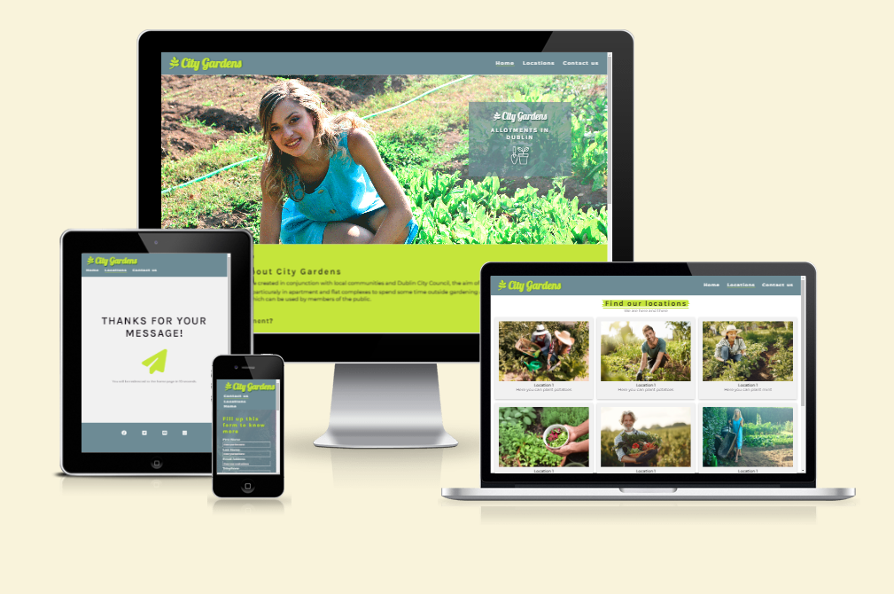
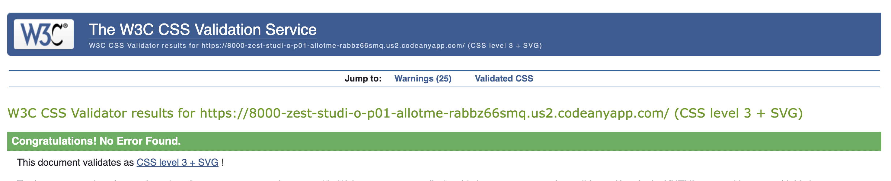
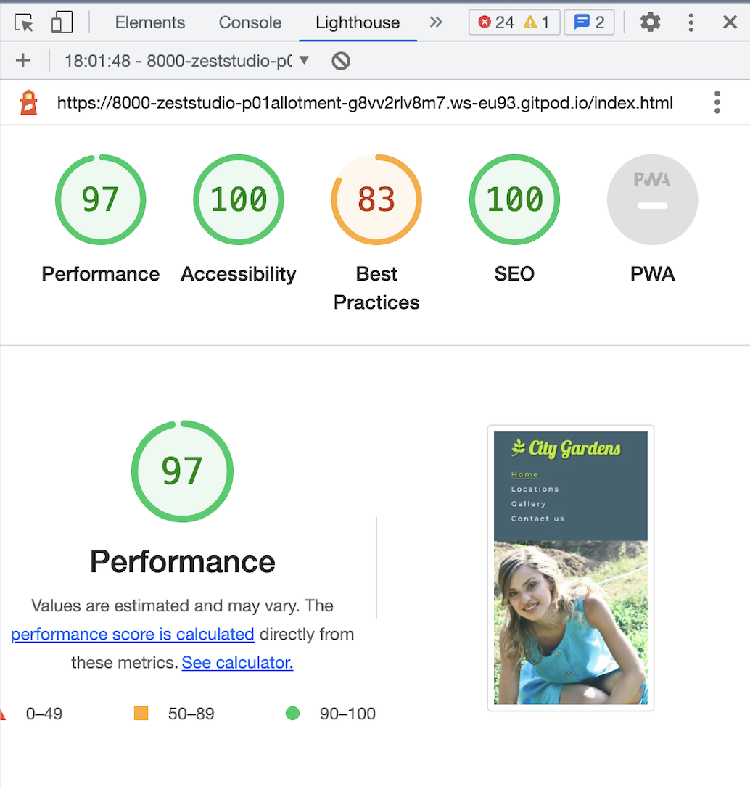
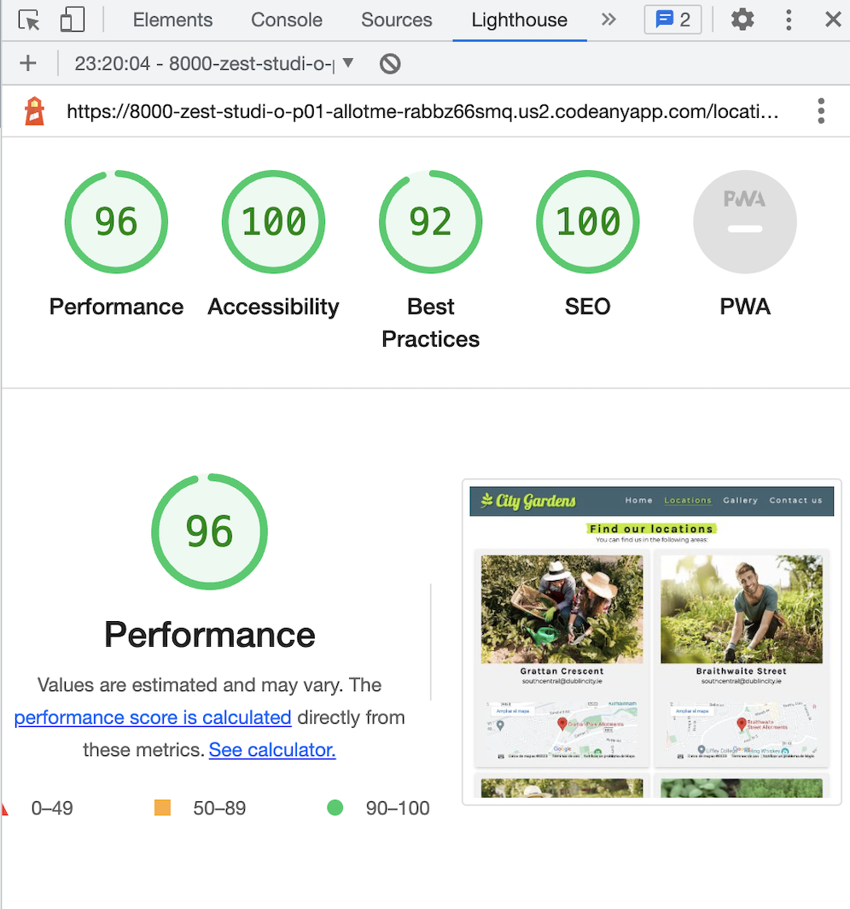
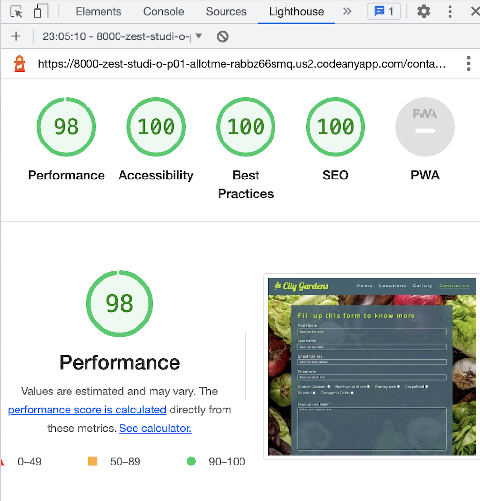

# City Gardens - Testing

Link to the live site here: [City Gardens](https://zest-studi-o.github.io/P01-Allotment-gardens/)

---

## CONTENTS

- [AUTOMATED TESTING](#AUTOMATED-TESTING)
  - [W3C Validator](#W3C-Validator)
  - [Lighthouse](#Lighthouse)
- [MANUAL TESTING](#MANUAL-TESTING)
  - [Testing User Stories](#Testing-User-Stories)
  - [Full Testing](#Full-Testing)

Manual testing was carried as soon as the project started using exploratory testing techniques and a list of bugs were identified and place in a table to tackle.
At the same time of building each page those were tested in different screen sizes using the developer tools to better adjust the design and make sure the website is responsive in all screensizes.
Automated testing was carried at a later stage using validators and all errors were fixed.

---

## AUTOMATED TESTING

### W3C Validator

HTML - No errors were returned when passing through the official W3C validator on the deployed site. All tests passed.
[W3C Validator](https://validator.w3.org/)

 
 

 

### Jigsaw Validator

CSS - No errors were found when passing through the official (Jigsaw) validator.
[Jigsaw Validator](https://jigsaw.w3.org/css-validator/)

 

---

### Lighthouse

I used Lighthouse within the Chrome Developer Tools to test the performance, accessibility, best practices and SEO of the website.
This test was run thorough different devices which returned different results.
For this project I focused on achieving 100% in accesibility as instructed. This is achieved in all pages.

### Desktop Results

### Mobile Results

---

## MANUAL TESTING

`First Time Visitors`
| Goals | How are they achieved? |
| :--- | :--- |
| As a user I want to have the site displayed clearly in different devices | I have developed this site to be fully responsive in all device sizes |
| As a user I want to find information on what is City Gardens and how to participate | The information is clearly displayed in the home page and a link to the contact form is provided to easy access to more information |
| As a user I want to show exactly where the gardens are located | I have created a locations page in which the allotmets are shown with their name and image, contact email and a google map so the users can easly locate them |
| As a user I want to be able to contact City Gardens with any queries or suggestions | There is a contact form to apply or for general enquiries and some other email adresses for the different allotments displayed in a clear manner and linked  |

`Returning Visitors`
| Goals | How are they achieved? |
| :--- | :--- |
| As a returning visitor I want to find images and videos of the allotments | In the home page there are different videos with users explaining about their experiences |
| As a returning visitor I want to be able to easily contact City Gardens with further questions I might have | The users can find a contact form page where they can ask questions or suggest improvements |

`Frequent Visitors`
| Goals | How are they achieved? |
| :--- | :--- |
| As a frequent visitor I want to see images of the people that participate in City Gardens| The user can see imagery in all pages, there is also a dedicated gallery page that showcases images from participants and the allotments |

### Full Testing

Full testing was performed on the following devices:

- Destop:
  - Custom Gaming computer with 2 screens set-up 24 inches and Windows OS
- Laptop:
  - Macbook Pro 2023 14 inch screen
- Mobile Devices:
  - Samsung Galaxy

Each device tested the site using the following browsers:

- Google Chrome
- Safari
- Firefox

## Test Cases

`Home page`
| Feature | Expected Result | Testing Performed | Actual Result | Pass/Fail |
| --- | --- | --- | --- | --- |
| The Sites title | Clicking on the logo link directs the user back to the home page | Clicked title | Home page reloads | Pass |
| Hero section | abc | abc | abc | Pass |
| About us section | abc | abc | abc | Pass |
| Video section | abc | abc | abc | Pass |

`Locations page`
| Feature | Expected Result | Testing Performed | Actual Result | Pass/Fail |
| --- | --- | --- | --- | --- |
| Images of the locations | abc | abc | abc | Pass |
| Map and address | abc | abc | abc | Pass |

`Contact us page`
| Feature | Expected Result | Testing Performed | Actual Result | Pass/Fail |
--- | --- | --- | --- | --- |
| Form | abc | abc | abc | Pass |

`Thank you page`
| Feature | Expected Result | Testing Performed | Actual Result | Pass/Fail |
--- | --- | --- | --- | --- |
| Mesage to the user | abc | abc | abc | Pass |
