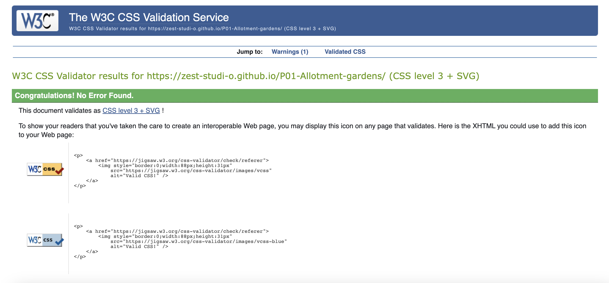
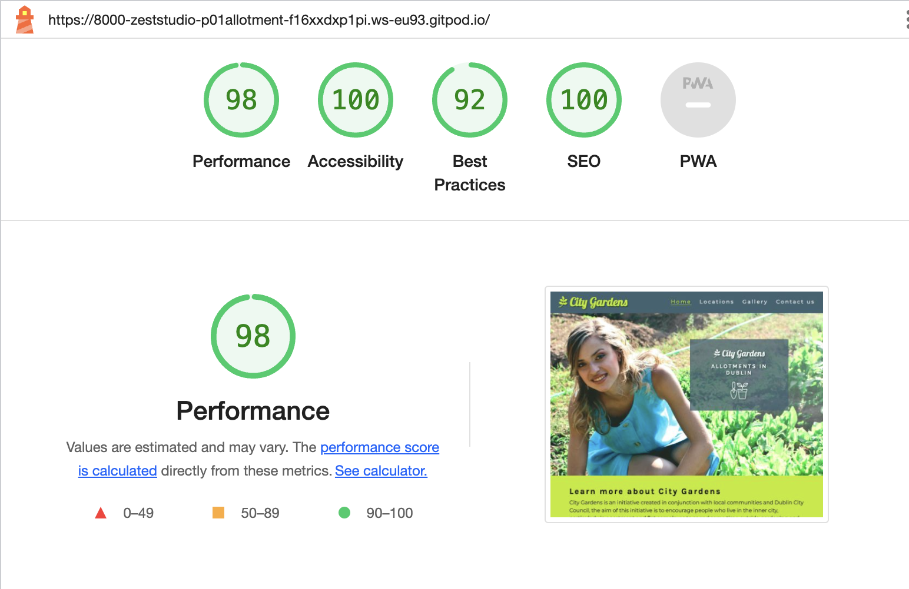
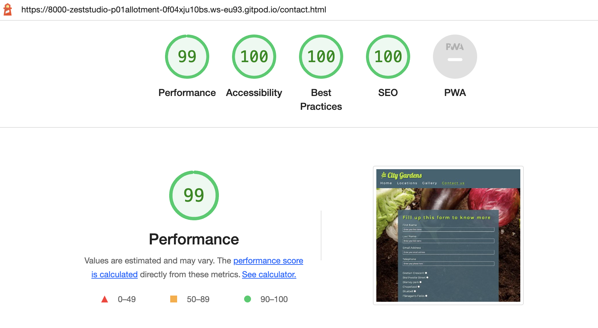

# City Gardens - Testing

Link to the live site here: [City Gardens](https://zest-studi-o.github.io/P01-Allotment-gardens/)

---

## CONTENTS

- [AUTOMATED TESTING](#AUTOMATED-TESTING)
  - [W3C Validator](#W3C-Validator)
  - [Lighthouse](#Lighthouse)
- [MANUAL TESTING](#MANUAL-TESTING)
  - [Testing User Stories](#Testing-User-Stories)
  - [Full Testing](#Full-Testing)
  - [Test Cases](#Test-Cases)

Manual testing was carried as soon as the project started using exploratory testing techniques and a list of bugs were identified and placed in a table to tackle.
At the same time of building each page the site was tested in different screen sizes using the developer tools to better adjust the design and make sure that it is responsive in all screen sizes.
Automated testing was carried at a later stage using validators and all errors were fixed, it was checked that all user goals are met and after this a test case table was created to test the website using different devices and screen sizes. To finish, the project was shared in slack for peer review.

---

## AUTOMATED TESTING

### W3C Validator

HTML - No errors were returned when passing through the official W3C validator on the deployed site. All tests passed.
[W3C Validator](https://validator.w3.org/)

 
 

 

### Jigsaw Validator

CSS - No errors were found when passing through the official (Jigsaw) validator.
[Jigsaw Validator](https://jigsaw.w3.org/css-validator/)

 

---

### Lighthouse

I used Lighthouse within the Chrome Developer Tools to test the performance, accessibility, best practices and SEO of the website.
This test was run thorough different devices which returned different results.
For this project I focused on achieving 100% in accessibility as instructed. This is achieved in all pages.

#### Desktop Results

#### Mobile Results

---

## MANUAL TESTING

### Testing User Stories

`First Time Visitors`
| Goals | How are they achieved? |
| :--- | :--- |
| As a user I want to have the site displayed clearly in different devices | I have developed this site to be fully responsive in all device sizes |
| As a user I want to find information on what is City Gardens and how to participate | The information is clearly displayed in the home page and a link to the contact form is provided to easy access to more information |
| As a user I want to show exactly where the gardens are located | I have created a locations page in which the allotments are shown with their name and image, contact email and a google map so the users can easily locate them |
| As a user I want to be able to contact City Gardens with any queries or suggestions | There is a contact form to apply or for general enquiries and some other email addresses for the different allotments displayed in a clear manner and linked  |

`Returning Visitors`
| Goals | How are they achieved? |
| :--- | :--- |
| As a returning visitor I want to find images and videos of the allotments | In the home page there are different videos with users explaining about their experiences |
| As a returning visitor I want to be able to easily contact City Gardens with further questions I might have | The users can find a contact form page where they can ask questions or suggest improvements |

`Frequent Visitors`
| Goals | How are they achieved? |
| :--- | :--- |
| As a frequent visitor I want to see images of the people that participate in City Gardens| The user can see imagery in all pages, there is also a dedicated gallery page that showcases images from participants and the allotments |

### Full Testing

Full testing was performed on the following devices:

- Desktop:
  - Custom Gaming computer with 2 screens set-up 24 inches and Windows OS
- Laptop:
  - Macbook Pro 2023 14 inch screen and Mac OS
- Android Mobile Devices:
  - Samsung Galaxy S20 
  - Samsung Galaxy A50 

Each device tested the site using the following browsers:

- Google Chrome
- Safari
- Firefox

### Test Cases
`All pages`
| Feature | Expected Result | Testing Performed | Actual Result | Pass/Fail |
| --- | --- | --- | --- | --- |
| Nav bar | Clicking any of the links directs the user to the relevant page | Clicked all pages in nav menu | Directs the user to the relevant page | Pass |
| The Sites title | Clicking on the logo link directs the user back to the home page | Clicked title | Home page reloads | Pass |
| Footer | Clicking any of the social media links directs the user to the relevant social media page | Clicked all social media icons in the footer | Directs the user to the relevant social media page | Pass |

`Home page`
| Feature | Expected Result | Testing Performed | Actual Result | Pass/Fail |
| --- | --- | --- | --- | --- |
| Hero section | Image and banner fully responsive | Resized to different screen sizes using dev tools plus different devices and the image and banner adjust | Fully responsive | Pass |
| About us section | Click on contact form directs the user to contact page where the form is located | Clicked link | The user gets redirected to contact page | Pass |
| Video section | When clicking a video the user is directed to youtube and the video plays  | Clicked all videos | User directed to youtube and video play | Pass |

`Locations page`
| Feature | Expected Result | Testing Performed | Actual Result | Pass/Fail |
| --- | --- | --- | --- | --- |
| Images of the locations | Images and map are fully responsive taking 3 columns for larger screens, 2 columns for medium screens and 1 column for small screens | Resized to different screen sizes using dev tools plus different devices and the columns and map display as expected | The user can navigate the location section using different screen sizes and devices  | Pass |
| Map and address | Clicking the map link directs the user to google maps exact location | Clicked link | The user gets redirected to the location in google maps | Pass |

`Gallery page`
| Feature | Expected Result | Testing Performed | Actual Result | Pass/Fail |
| --- | --- | --- | --- | --- |
| Images in the gallery | Images  are fully responsive being displayed in a grid for desktop version and taking 1 column for smaller screens such as tablet or phone | Resized to different screen sizes using dev tools plus different devices and the gallery displays as expected with margins and no clipping | The user can navigate the location section using different screen sizes and devices  | Pass |

`Contact us page`
| Feature | Expected Result | Testing Performed | Actual Result | Pass/Fail |
--- | --- | --- | --- | --- |
| Form submission | Entering correct details and click submit directs the user to the thank you page | Fill up the form correctly and hit submit button | The user gets prompted with a thank you message and redirected to home page in 10 seconds | Pass |
| Email validation | Entering incorrect details ask the user to enter the appropriate format | Fill up the form incorrectly and attempt to submit | The user gets prompted with a message asking to enter a correct email address | Pass |
| Radio button validation | The user needs to select a radio button to continue | Attempt to send the form without selecting a radio button option | The user gets prompted with a message asking to select an option | Pass |
| Character number validation | Entering less or more character than required | Fill up the form with less or more characters than the established and attempt to submit | The user gets prompted with a message asking to enter the correct number of characters | Pass |

`Thank you page`
| Feature | Expected Result | Testing Performed | Actual Result | Pass/Fail |
--- | --- | --- | --- | --- |
| Message to the user | After hitting submit in the contact form the user gets prompted with the thank you page message, the user has the appropriate time to read it and then it redirected to the home page | Submitted the form correctly | The user gets prompted with a thank you message and redirected to home page in 10 seconds | Pass |
